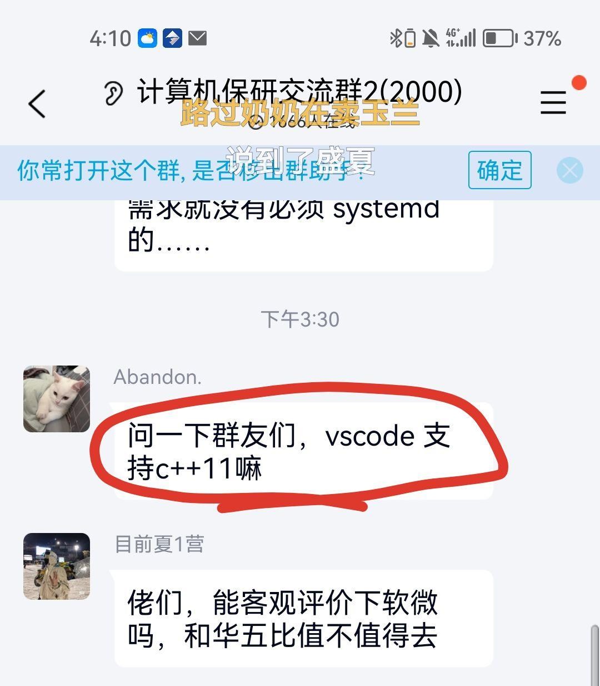

# CS100 Recitation 1

---

# Grateful acknowledgment to GKxx for his outstanding efforts on CS100.

---

## GKxx

- Bilibili: [__gkxx](https://space.bilibili.com/1656746432?spm_id_from=333.337.search-card.all.click)
- GitHub: [GKxxQAQ](https://github.com/GKxxQAQ)


---


## TA Members


  李超凡	lichf1@shanghaitech.edu.cn
  - 2022 SI100B Fall SP TA
  - 2023 SI100B Fall SP head TA & 2023 Fall SIST outstanding TA
  - 2024 SI100B Spring EE headTA & 2024 Spring SIST outstandingTA
  -  IGEM2023top10&金奖，全国大学生电子设计大赛二等奖，21级娄鑫导师组组长，社会实践队长，科道书院团总支副书记，篮球俱乐部副社长，Sertraline乐队主唱、吉他手，四级压线王，六级耐考王，知乎盐选会员，B站大会员，网易云黑金会员

----

# TA teams

- Xiao Liu（刘 晓）: liuxiao2022@shanghaitech.edu.cn
- Ye Gao（高 烨）: gaoye2022@shanghaitech.edu.cn
- Zijun Zhao（赵梓君）: zhaozj2022@shanghaitech.edu.cn
- Chaofan Li（李超凡）: lichf1@shanghaitech.edu.cn
- Bocheng Zhang（张博成）: zhangbch2023@shanghaitech.edu.cn
- Jinxi Xiao（肖锦熙）: xiaojx@shanghaitech.edu.cn

More information can be found on Piazza under ["Staff"](https://piazza.com/shanghaitech.edu.cn/fall2024/cs100/staff).


---

## 目录

- 开始
- 编译、运行一个 C 程序
- 初识函数
- `scanf` 和 `printf`
- 算术类型

---

# 开始

---

## 为什么要学“任何东西”？

为什么要学 C/C++ ？

- 为什么要学微积分/离散数学/XXXX/......？

---

## 为什么要学“任何东西”？

为什么要学 C/C++ ？

- 为什么要学微积分/离散数学/XXXX/......？

**重走一个学科/领域从无到有的发现历程**

- 理解学科中的基本思想、基本方法、里程碑、走过的弯路
- 锻炼学习的能力
- 应用、创新、革命 ......

---

## 怎样学好这门课

关键：**把课件、课本等资料上的示例代码独立地实现一遍**

- 作业也会有很多直接来自于课件（包括习题课）的题目
  - 看懂、掌握基本的知识
  - （尝试）独立地实现
  - 对比课件上的写法，有什么区别？哪种更好？
- 仅仅做到能“看懂”是**不够的**，只有独立实现才能内化为自己的知识。
  - 学数学也是如此。

---

## 关于学术诚信

我们采取相对宽松的规则。

- 简单题、教学题不查重，鼓励模仿和借鉴**好的写法**、**好的思路**。
  - 部分题目会设置与 TA 的线下 check 。
- **允许**帮别人 debug 。
- 鼓励使用 AI 工具辅助学习，比如让 ChatGPT/Copilot 帮你解释代码。
  - 注意谨慎求证。
- 但是禁止**直接抄袭**来自他人、网络、 AI 生成的代码。

---

# About TA's responsibilities...

- **You can ask TAs to:**

    - 帮你看看你代码可能存在的问题
    -  帮助你理解课程内容
    - ...

- **TAs can refuse you to:**
    - 给AI生成的代码Debug
    - 咨询请假事务和其他事务
    - 在ddl之前提供你正确的代码
    - 延长作业ddl

---

# 环境配置

---

# 环境配置

- Option 1 : Code editor + Compiler
    - Code editor代码编辑器: VS Code
    - Compiler编译器: MinGW(Minimal GNU for Windows) is suggested for Windows users.
- Option 2 : IDE(Integrated Development Environment)集成开发环境
    - CLion, Virtual Studio...

如果你刚刚开始，建议使用“VS Code”，因为它通常可以满足你作为初学者的所有需求。
随着项目的增长和任务的变得更加复杂，您可能需要考虑在工具链中添加一个IDE，因为它们可以帮助您完成一些非常具有挑战性的日常任务。

---


# Review

## introduction to C/C++

- C/C++和Python有什么不同
- 如何运行一个C语言程序？

---

# Review

## introduction to C/C++

- C/C++编译（Compile）
- Python解释（Inteprete）


---

# 编译语言和解释语言


---

# 编译语言和解释语言

- 编译性语言会更有效率
- 解释性语言会更有灵活性（跨平台）

---

# 编译语言和解释语言

## 编译性语言会更有效率

- C语言会把程序在编译的时候编译成二进制执行文件(.exe/.o)
- 为了方便有时候程序员会把万行代码拆成几百份小文件(.c/.h)
  - 几百个源代码文件可以编译为几百个二进制执行文件(.o)
  - 修改一行代码不需要编译所有的代码，只用编译那一行代码所在的一个文件


---
# 编译语言和解释语言

## 解释性语言会更有灵活性

- java和python的源文件会在它们被运行的时候被**解释**成字节码


---

# 编译语言和解释语言

## 解释性语言会更有灵活性

- java和python的源文件会在它们被运行的时候被**解释**成字节码
- 字节码是与平台无关的指令


---

## 编译、运行一个 C 程序

---
## **编译** 、 运行一个C程序

假设我们现在有一个文件 "hello.c".
- Firstly, we compile it.
    - Command: `gcc hello.c -o hello`
        - `-o`" 即为指定输出文件的名字
        -  如果没有`-o`，文件名就默认为"a"
    - 编译之后，**可执行文件**被生成
        - On Windows, it will be named "hello.exe".
        - On Linux/MacOS, it will be named "hello".

---

## 编译、**运行**一个C程序

Now we have got the compiled file "hello.exe" or "hello".
- Secondly, we run it.
    - Command: Linux/MacOS `./hello`; Windows: `.\hello`
    - 当然你也可以双击它，但它会“一闪而过”。（因为运行结束后窗口就会关闭）

---

## **编译、运行**一个C程序

#### We should type `gcc hello.c -o hello` and `./hello` in the **terminal（终端）** to compile and run.
- 终端是一个CLI（命令行界面），允许您与操作系统通信。
- 您必须要求**操作系统**为您运行可执行文件。

#### 在 VSCode/CLion 的终端中执行以上指令

- VSCode: `ctrl`+`` ` `` 开启终端，默认 working directory 为当前打开的文件夹。

- CLion: 最下面 "Terminal"/“终端”，或 `Alt`+`F12`

可以先 `cd` 到方便的位置（如果需要的话）


---

## 环境变量 `PATH`

当你执行 `gcc hello.c -o hello` 的时候，你唤醒的 `gcc` 是你安装在某处的 `gcc` (Linux/Mac) / `gcc.exe` (Windows)

例如，Windows 上的 `D:\mingw64\bin\gcc.exe`

终端如何认识到你想找的 `gcc` 是 `D:\mingw64\bin\gcc.exe`？

---

## 环境变量 `PATH`

当你执行 `gcc hello.c -o hello` 的时候，你唤醒的 `gcc` 是你安装在某处的 `gcc` (Linux/Mac) / `gcc.exe` (Windows)

例如，Windows 上的 `D:\mingw64\bin\gcc.exe`

终端如何认识到你想找的 `gcc` 是 `D:\mingw64\bin\gcc.exe`？

- 将 `D:\mingw64\bin` 添加到环境变量 `PATH`。

---

## 编译、运行、调试一个 C 程序

**VSCode/CLion 本身不具备任何编译、运行、调试的功能！** 它只是把编译器、可执行文件和 GDB 的结果打在公屏上，然后给你提供一些方便操作的按钮。

<a align="center">
  
</a>

---

# 初识函数

---

## 定义一个函数

语法：`ReturnType FunctionName(Parameters) { FunctionBody }`

- 数学上，函数是 $f:S\mapsto T$
- 一个函数的**参数**的类型对应 $S$，**返回值**类型对应 $T$。

例：下取整函数 $f(x)=\lfloor x\rfloor$ 的参数和返回值类型分别是什么？

---

## 定义一个函数

语法：`ReturnType FunctionName(Parameters) { FunctionBody }`

- 数学上，函数是 $f:S\mapsto T$
- 一个函数的**参数**的类型对应 $S$，**返回值**类型对应 $T$。

例：下取整函数 $f(x)=\lfloor x\rfloor$ 的参数和返回值类型分别是什么？

```c
int floor(double x) {
  // ...
}
```

---

## 定义一个函数

一个函数可以接受多个参数（$f:S_1\times S_2\times\cdots\times S_n\mapsto T$），**每个参数的类型都需要写出来**。

- 哪怕它和前一个参数类型相同，也不可以省去。`(int x, int y)` 不可以省略为 `(int x, y)`

```c
ReturnType myFunction(Type1 a1, Type2 a2, Type3 a3) {
  // ...
}
```

---

## 定义一个函数

一个函数可以没有返回值，这样的函数返回值类型为 `void`。

和数学函数不同，C 函数不仅仅是“接受一些参数、返回一个值”，它实际上就是将一小段具有特定功能的代码单独拎出来，并且给它起个名字。

---

## 定义一个函数

一个函数可以不接受参数（$f:\varnothing\mapsto T$），写法是在参数列表里放一个 `void`

```c
ReturnType do_some_work(void) {
  // ...
}
```

和 C++ 不同，**参数列表空着并不代表不接受参数**，而是表示 "accepting unknown parameters"。这项规则自 C23 起才被删除。

- 这是 C 的一个历史遗留问题。上古时期的 C 并不注重参数类型检查，这可能更接近汇编的风格，但也更容易出错。

---

## 另一个历史遗留问题

在 C99 之前，一个函数如果不写返回值类型，则返回值类型默认为 `int`。

事实上在旧的 C 语言中存在着大量的“默认为 `int`”的规则，在很多场合下这种写法极易引发难以预料的问题。

- 不幸的是，为了兼容已经存在的上亿行旧代码，编译器大概率会允许这种写法，并仅仅给出一个 warning。

你可能见过一些人写这样的 `main` 函数：

```c
main() {
  // ...
}
```

**这不符合现代 C 语言的语法，也是极不推荐的写法。**

---

## 更糟糕的历史遗留问题

如果你调用了一个未经声明的函数

```c
#include <stdio.h>

int main(void) {
  int x = my_mysterious_function();
  printf("%d\n", x);
}
```

C++ 编译器会给出一个十分正常的报错: "... was not declared in this scope"

```
a.cpp: In function ‘int main()’:
a.cpp:4:11: error: ‘my_mysterious_function’ was not declared in this scope
    4 |   int x = my_mysterious_function();
      |           ^~~~~~~~~~~~~~~~~~~~~~
```

---

## 更糟糕的历史遗留问题

如果你调用了一个未经声明的函数

```c
#include <stdio.h>

int main(void) {
  int x = my_mysterious_function();
  printf("%d\n", x);
}
```

而 C 编译器会允许，并且给出一个令人困惑的 warning: "implicit declaration"

```
a.c: In function ‘main’:
a.c:4:11: warning: implicit declaration of function ‘my_mysterious_function’
[-Wimplicit-function-declaration]
    4 |   int x = my_mysterious_function();
      |           ^~~~~~~~~~~~~~~~~~~~~~
```

当然，它是无法运行的，链接器会抱怨“找不到名为 `my_mysterious_function` 的函数”。

---

## 更糟糕的历史遗留问题

如果你调用了一个未经声明的函数

```c
#include <stdio.h>

int main(void) {
  int x = my_mysterious_function();
  printf("%d\n", x);
}
```

C 标准认为你“隐式地声明” (implicitly declare) 了这个函数，于是压力全都给到链接器。

这一规则 C99 起被删除，但为了向后兼容 (backward compatibility)，编译器很可能仍然支持，只是给一个 warning。

---

## `main` 函数的返回值

函数的**返回值**是传给它的调用者的。

- `main` 的“调用者”是谁？

---

## `main` 函数的返回值

函数的**返回值**是传给它的调用者的。

- `main` 的“调用者”是谁？——程序的调用者/“宿主环境” (hosted environment)

`main` 函数返回 `0` ——程序正常退出

`main` 函数返回其它值——代表某种错误

- 一些程序会用不同的返回值表达不同的含义。
- 也有的程序只是在“任何错误”发生时都返回 `1` 。

---

# `scanf` 和 `printf`

虽然文档有点复杂，但也要试着在这里检索你需要的信息。

[scanf](https://en.cppreference.com/w/c/io/fscanf)

[printf](https://en.cppreference.com/w/c/io/fprintf)

---

## "A+B" problem

```c
#include <stdio.h>

int main(void) {
  int a, b;
  scanf("%d%d", &a, &b);
  printf("%d\n", a + b);
  return 0;
}
```

---

## A+B Problem

约定输入格式：两行，每行一个整数，分别表示 `a` 和 `b`。

- `scanf("%d\n%d\n", &a, &b)` 会发生什么？试一试。

---

## A+B Problem

约定输入格式：两行，每行一个整数，分别表示 `a` 和 `b`。

- `scanf("%d\n%d\n", &a, &b)` 会卡住，**直到你输入了一个非空白字符为止**。
- 看看标准：
  
  > whitespace characters: any single whitespace character in the format string **consumes all available consecutive whitespace characters** from the input (determined as if by calling isspace in a loop). Note that **there is no difference** between `"\n"`, `" "`, `"\t\t"`, or other whitespace in the format string.
- whitespace character: “空白字符”，包括空格、换行、回车、制表等。

---

## A+B Problem

约定输入格式：两行，每行一个整数，分别表示 `a` 和 `b`。

- `scanf("%d%d", &a, &b)` 可以吗？试一试。

---

## A+B Problem

约定输入格式：两行，每行一个整数，分别表示 `a` 和 `b`。

- `scanf("%d%d", &a, &b)` 可以。
- 中间的换行符不写也可以？看看标准：
  
  > `"%d"` matches a decimal integer.

  > The format of the number is the same as expected by `strtol` with the value 10 for the base argument.
  
- `strtol` 是什么鬼？[点进去看看](https://en.cppreference.com/w/c/string/byte/strtol)：
  
  > Interprets an integer value in a byte string pointed to by str.

  > **Discards any whitespace characters** (as identified by calling `isspace`) until the first non-whitespace character is found, then...

---

## `printf`

`double` 需要用 `%lf` 输出。如果我用 `%d` 输出，会怎样？

```c
#include <stdio.h>

int main(void) {
  double pi = 3.14;
  printf("%d\n", pi);
  return 0;
}
```

它和先将 `pi` 转换为 `int`（小数部分截去）再输出的效果一样吗？

```c
double pi = 3.14;
int pi_int = pi; // pi_int 值为 3
printf("%d\n", pi_int);
```

---

## `printf`

在 `scanf` 和 `printf` 中，conversion specifier 与对应的变量类型不匹配是 [**undefined behavior**](https://en.cppreference.com/w/c/language/behavior)：**你不能对程序的行为做任何假定。**

以下说法统统是错的：

- ~~它会进行某种类型转换再输出~~
- ~~它会输出一个值，只是我不知道它是多少罢了~~

程序完全有可能在这里直接崩溃。此外，编译器可以假定你的程序不含 undefined behavior，所以它如果发现这里有 undefined behavior，就可以直接把这行代码删掉，这完全符合语言标准。

---

# Tools

---

# Tools 

- CppReference/Textbook: C/C++ 的编程语言参考资料
- VS Code / Clion: 写代码，debug的工具
- *Debugger(bundled): 帮助你写代码和debug的工具
- *CMake: 一个跨平台的项目构建工具，在多文件编译的时候用到
- *Git:  一个帮助你管理代码版本和查看代码改动的工具
- ...

**Note:** 标有星号（*）的工具很重要，但将在我们的课程中进行功能介绍。为了更深入地了解它们的用法，**我们鼓励您独立探索**

---

# *Debugger

- **breakpoint断点**：在特定代码行设置暂停执行，以便更仔细地查看**程序在某一行代码执行前的状态**。
- **监视变量**：在程序运行时监视变量或表达式的值。
- **逐步执行**：一步一步地运行程序，可以逐行（Step Over），进入函数（Step into），也可以执行函数的剩余部分并在该函数执行结束之后暂停（Step Out）。
- ...

---

# *Git

- `git init` : 初始化一个git仓库
- `git commit` : 本地保存仓库更改
- `git reset` : 回溯到某个版本
- `git log` : 显示历史提交记录
- `git push` : 把本地的更改上传远程云端
- `git pull` : 从云端拉取远端最新的更改使得和云端仓库一致
- ...

---

# Good luck and enjoy programming!

## CS100 Recitation 1

 


