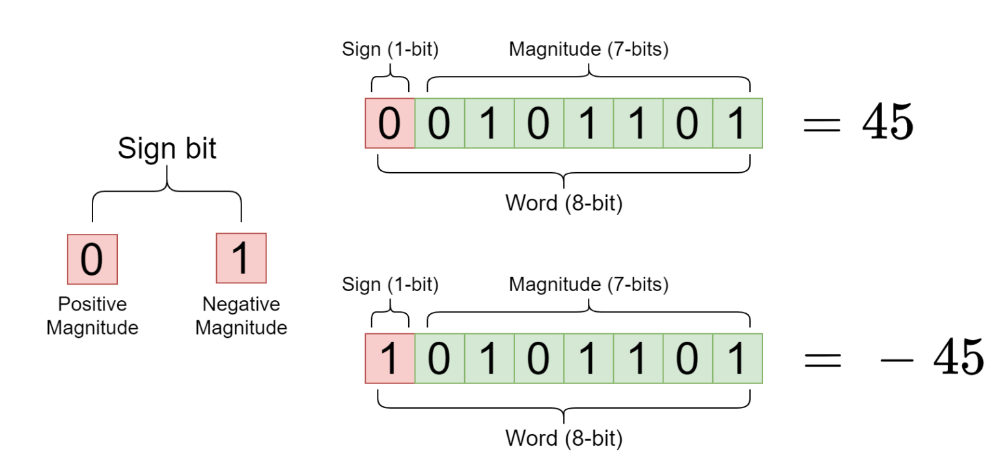
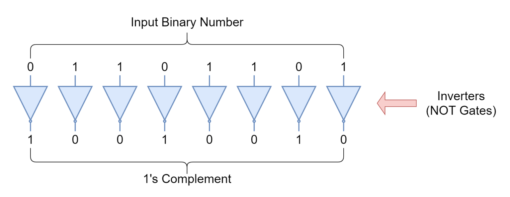
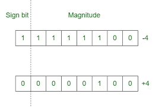

# CS100 Recitation 2 — Week 2

## From Chaofan Li

---

# CS100 philosophy: *Understanding* AND ***Practising***
## 纸上得来终觉浅，绝知此事要躬行。

- Today's recitation will include several exercises. We welcome all of your participation.
---

# Contents

- Lecture notes
  - undefined behavior, integer promotion, binary number representation
- Arithmetic Types
  - `sizeof`, floating-point error
- Literals
  - integer/floating-point/character literals
- Operators
  - precedence, associativity, order of evaluation
  - bitwise operators

---

# Lecture notes

- [Undefined behavior](https://en.cppreference.com/w/c/language/behavior )
- *[Integer promotion](https://en.cppreference.com/w/c/language/conversion)
- *Binary number representation: sign-and-magnitude, one's complement, two's complement

<br>

*Note: The items with asterisk(\*) are beyond the scope of this class.*

---

# [Undefined Behavior](https://en.cppreference.com/w/c/language/behavior )

## There are ***no restrictions*** on the behavior of the program.

- memory accesses outside of array bounds (covered later)
- **signed integer overflow**
- null pointer dereference (covered later)

<br/>

### Note: unspecified behavior
- Two or more behaviors are permitted and the implementation is not required to document the effects of each behavior

---

# *[Integer Promotion](https://en.cppreference.com/w/c/language/conversion)(整型提升)*


<div class="columns">
<div class="columns-left">

- Definition: Integer promotion is the implicit conversion of a value of any integer type with rank less to the value of type `int` or `unsigned int`.
- Application:
  - as part of usual arithmetic conversions
  - Ex. promotion of operands of realtional operator `==`

</div>
<div class="columns-right">

```c
#include <stdio.h>

int main(void){
    char a = 251;
    unsigned char b = a;

    if (a == b)
        printf("Same.\n");
    else
        printf("Not Same.\n");

    return 0;
}
```

</div>
</div>

---

# *Binary Number Representation*

- Sign-and-Magnitude
- One's complement
- Two's complement

---

# *Binary Number Representation: Sign-and-Magnitude(大小)*



---

# *Binary Number Representation: One's complement(反码）*



---

# *Binary Number Representation: Two's complement（补码）*

<style>
img[alt~="center"] {
  display: block;
  margin: 0 auto;
}
</style>



---

# [Arithmetic Types](https://en.cppreference.com/w/c/language/arithmetic_types)
- Overview
- Width of integer types and `sizeof`
- Error of floating-points

---

# Arithmetic Types: Boolean, Character, Integer, Floating
Note: Sometimes, **characters** and **Boolean values** are also considered as **integers**.

<a align="center">
  
</a>

---

# Width of integer types and `sizeof`

A 32-bit number: $2979269462_{\text{ten}}=10110001100101000000101101010110_{\text{two}}$.

<a align="center">
  
</a>

- A byte is 8 bits on most platforms.
- `sizeof(T)` is the number of **bytes** that `T` holds.
  - `sizeof()` returns a value of type [`size_t`](https://en.cppreference.com/w/c/types/size_t). *(covered later)*
- The conversion specifier for `size_t` is `%zu`:
    ```c
    printf("%zu\n", sizeof(double));
    ```

- If MinGW has issues with `%zu`, cast the result to int and use `%d` instead.


    ```c
    printf("%d\n", (int)sizeof(double));
    ```


--- 

# Width of integer types and `sizeof`

<div align="center">

| type        | width (at least) | width (usually) |
| ----------- | ---------------- | --------------- |
| `short`     | 16 bits          | 16 bits         |
| `int`       | 16 bits          | 32 bits         |
| `long`      | 32 bits          | 32 or 64 bits   |
| `long long` | 64 bits          | 64 bits         |
</div>

- `sizeof(signed T) == sizeof(unsigned T)`
- **It is also guaranteed that `sizeof(short)` $\leqslant$ `sizeof(int)` $\leqslant$ `sizeof(long)` $\leqslant$ `sizeof(long long)`.**
- You can print the width of each type to see how your machine implements these types.

---

# Error（误差） of floating-points

---

# Exercise 1

Define a function `midpoint` that takes two 64-bit integers and returns their average. Be careful when choosing **the return type and parameters' types**.

- After defining the function, calculate the average of `9007199254740993` and `9007199254740993` using your function.

---

# Error of floating-points: ***inevitable（必然的）***

- ### When checking if a floating-point number is zero, you must use $|x|<\epsilon$, where $\epsilon$ could be a small number like $10^{-8}$.

- #### To check if two floating-point numbers are equal, use $|a-b|<\epsilon$.

---

# Literals（字面值）
- Integer Literals（整型字面值）
- Floating-point Literals（浮点数字面值）
- Character Literals（字符字面值）
- ~~String Literals（字符串字面值）~~
- ~~Compound Literals（复合字面值）~~

---

# Literals: Overview

- Every expression in C has a specific type determined at compile time. 
  - An expression is a sequence of *operators* and their *operands*, that specifies a computation.
- For example, `int a = 42;` `double b = 3.14`
  - What are the types of `a` and `b`?
  - What are the types of `42` and `3.14`?


---

# Literals: Overview

Writing values explicitly like `42` are known as literals.

- Literals are immutable.（unchangeable）
- A literal is simply a value. (字面值-字面即是值；把值写在脸上的就是字面值)

---

# Integer literals: `42`, `100L`, `0ll`, `405ul`
- Suffix: `L`(long), `ll`(long long), `ul`(unsigned long) — these indicate the type of the literal and are case-insensitive.（大小写不敏感）
  - It is recommended to avoid mixing `l and `L, such as in `lL` or `Ll`; instead, consistently use `L`.
  - Suffixes can be combined freely.
- If there's no suffix in an integer literal, the default type is `int`.
  - If the value exceeds the range of `int`, it will incrementally match to `int`->`long`->`long long`->`__int128`. If `__int128` is not supported, an error will occur (ill-formed).

- "Negative literals" do **not exist**; for example, `-42` represents an expression formed by applying the unary minus operator `-` to the literal `42`.

---

# Base（进制） of Integer literals

- `0xBAADF00D`， `052`，`0b101010`（C23），……
- **Prefixes** (case-insensitive):
  - Hexadecimal literal: `0x`
  - Octal literal: `0`
  - Binary literal: `0b`(since C23)
  
    - The C++ compiler has supported binary literal since C++14.

---

# Floating-point Literals
- `3.14`, `3.14f`, `3.14l`, `1e8`, `3e-8`
- Suffixes **(case-insensitive)**：
  - *default：*  `double`
  - `f` ： `float`
  - `l` ： `long double`
- **Scientific notation is always a floating-point number.**
  - For instance, `1e8` represents $10^8$, but it is of type `double`, not `int`.

---

# Character Literals: `'a'`,  `'\n'`,  `'1'`
- The type is `int`.
  - In C++, it is represented as `char`.
> Character literals are individual characters of type `int` suitable for conversion to a character type or of type `char8_t`,(since C23) `char16_t`, `char32_t`, or (since C11)`wchar_t`.
- Example: `char c = 'a';`
  - The content stored in c is the integer 97, which is the [ASCII](https://en.cppreference.com/w/c/language/ascii)  code for 'a', not an image.
  - **There's no "conversion" between a character and its corresponding ASCII code! They are essentially the same.**

---

# Exercise 2

Given that the character `'c'` is a digit (`'1'`, `'2'`, …), determine the numerical value(`int`) it represents.
- Input: `c` - A single character representing a digit. 
  - If `c` is not a digit, the behavior is undefined.
- Output: The corresponding numerical value as an **integer**.

---

# Exercise 3

- If you can only use `getchar()` to read a ***character***, how would you read a non-negative ***integer***?
  -  `getchar()` : [CppReference](https://en.cppreference.com/w/c/io/getchar)
- Enhance the robustness: What if at the beginning of the input, there's some noise like leading whitespaces?
  - using functions declared in the standard library header `<ctype.h>`
  
    - [character classification functions](https://en.cppreference.com/w/c/string/byte#Character_classification)

---

# Operators
- Precedence, Associativity, Order of Evaluation
- Bitwise operators

---

# Operators: Precedence（优先级）and Associativity（结合性）
- Precedence: determines which operation to **perform first**
  - The expression `f() + g() * h()` is interpreted as `f() + (g() * h())`, not as `(f() + g()) * h()`.
- Associativity: how **operators of the same precedence** are grouped in an expression
  - The expression `f() - g() + h()` is interpreted as `(f() - g()) + h()`, not as `f() - (g() + h())`.
- [Precedence and Associativity Tables - CppReference](https://en.cppreference.com/w/c/language/operator_precedence)

- a classic question: [Piazza](https://piazza.com/class/lszwrwj2s8231h/post/17)

---

# Operators: Associativity

Associativity: how **operators of the same precedence** are grouped in an expression

- Left Associativity: operations are grouped from the left
  - Operators with the same precedence are associated from left to right; the operator that appears first binds first.
  - For example, the expression `f() - g() + h()` is interpreted as `(f() - g()) + h()`, not as `f() - (g() + h())`.
- Right Associativity: operations are grouped from the left
  - For example, the assignment operator `=`: `a = b = c`
  
    - Step 1: `a = (b = c)`
  
    - Step 2: `b = c` returns `b`( equal to `c`)
  
    - Step 3: `a = b`

---

# Operators: Order of Evaluation（运算顺序）

- **Very important: Order of Evaluation is independent from both precedence and associativity.**
- ***Very Very important: Order of evaluation of the operands of any C operator is unspecified (except where mentioned later).***

---

# Operators: Order of Evaluation

- What is the calling order for `f()`, `g()`, and `h()` in the previous examples? <br> (`f() - g() + h()`, `f() - (g() + h())`, ... )
  - It is **unspecified（未指定）**.
  - You most likely cannot define precisely what "unspecified" means; perhaps some students have already noted down "this is unspecified" in their notebooks.
  - I hope you can understand what truly happens during compilation; the answer is right at your fingertips [order of evaluation-CppReference](https://en.cppreference.com/w/c/language/eval_order).

- Another example: `func(f(), g(), h())`
  - The calling order of the functions `f()`, `g()`, and `h()` here is also unspecified.

---

# Operators: Order of Evaluation

If the order of evaluation of two expressions `A` and `B` is unspecified, and they either:

- Both modify the value of a variable, or
- One modifies the value of a variable and the other reads that value,

then this constitutes **undefined behavior**.<br>

- Example: What is the result of `i = i++ + 2`?
  - Once you start analyzing whether it is `+1` or `+2`, you have fallen into the **trap of undefined behavior**. 
    (just like to analyze `double pi = 3.14; printf("%d\n", pi);`)
      - `++` modifies `i`, and the assignment also modifies `i`. The order of these modifications is unspecified, hence it is **undefined behavior**.

---

## Operators with **determined evaluation order**

Among common operators, only four have a determined evaluation order: `&&`, `||`, `?:`, and `,`.
- `&&` & `||`: short-circuit evaluation(or minimal evaluation, McCarthy evaluation)
  - evaluate the left side first; ***the right side is not evaluated if not necessary***

- `cond ? t : f`
  - evaluate `cond` first, then evaluate `t` or `f` based on the truth value of `cond`
  - only one of `t` or `f` is evaluated

- `,`: Executes multiple expressions in sequence, with **the whole comma expression's value being that of the *last expression* in the series**.

---

# Exercise 4

```C
int main(void){
  int a = 1;
  int b = (a++, a + 100, a - 10);
}
```

What is the value of `b` in the program above?

---

# Operators: Bitwise Operators（位运算符）

`~`, `&`, `^`, `|`, `<<`, `>>`, and compound assignment operators（复合赋值运算符） `&=`, `|=`, `^=`, `<<=`, `>>=`

<div align="center">

| Operator | Operator Name      | Example  | Result                          |
| -------- | ------------------ | -------- | ------------------------------- |
| `~`      | Bitwise NOT        | `~a`     | the bitwise NOT of `a`          |
| `&`      | Bitwise AND        | `a & b`  | the bitwise AND of `a` and `b`  |
| `\|`     | Bitwise OR         | `a \| b` | the bitwise OR of `a` and `b`   |
| `^`      | Bitwise XOR        | `a ^ b`  | the bitwise XOR of `a` and `b`  |
| `<<`     | Bitwise Left Shift | `a << i` | `a` left-shifted by `i`         |
| `>>`     | Bitwise Right Shift| `a >> i` | `a` right-shifted by `i`        |

</div>

---

# Bitwise Operators: `~`, `&`, `|`, `^`

- `~a`: Returns the result of flipping every binary bit of `a`.
  - For example, the bitwise NOT of $10010110_{\text{two}}$ equals $1101001_{\text{two}}$.
- The $i^{th}$ bit of `a & b` is `1` if and only if **both the $i^{th}$ bits of `a` and `b` are `1`.**
- The $i^{th}$ bit of `a | b` is `1` if and only if **at least one** of the $i^{th}$ bits of `a` and `b` is `1`.
- The $i^{th}$ bit of `a ^ b` is `1` if and only if the $i^{th}$ bits of `a` and `b` are **different**.

<br>

Example: `a & 1` :
- a bitwise AND between `a` and $\underbrace{0\cdots00}_{n-1 \quad bits}1$${}_{\text{two}}$, 
- which is equivalent to `a % 2`.

---

# Bitwise Operators: `<<`, `>>`

Assume `a` is an unsigned integer.

- `a << i` returns the result of **shifting the binary bits of `a` to the left by `i` positions**.
  - For example, `a << 1` is equivalent to `a * 2`, and `a << i` is equivalent to multiplying `a` by $2^i$.
  - ***Bits that overflow on the left are discarded.***
- `a >> i` returns the result of **shifting the binary bits of `a` to the right by `i` positions**.
  - For example, `a >> 1` is equivalent to `a / 2`. 
  - ***Bits that overflow on the right are discarded.***

---

# Exercise 5: How do you get $2^n$?

--- 

# Exercise 5: How do you get $2^n$?

`1 << n`

- But `1` is an `int` literal.
- If `n` is large, you might need `1u << n`, `1ll << n`, etc.

--- 

# Exercise 6

How do you obtain the $i$-th bit of an unsigned integer `x`?

- Let's agree that `i` is in the range $[0,N)$, where `N` is the total number of bits in `x`'s type. The $0$-th bit is the rightmost bit (LSB, least significant bit).

```c
int test_bit(unsigned x, unsigned i) {
  // TODO
}
```

---

# Exercise 7

How do you flip the $i$-th bit of an unsigned integer `x`?

```c
unsigned bit_flip(unsigned x, unsigned i) {
  // TODO
}
```

---

# Exercise 8

How do you extract the bit range $[low, high)$ from an unsigned integer `x`?

```c
unsigned bit_slice(unsigned x, unsigned low, unsigned high) {
  // TODO
}
```

---

# Exercise 9: Magic of XOR

Given $n$ non-negative 32-bit integers, among which **one number appears an odd number of times, while others appear an even number of times**. 
- Find the number that appears an odd number of times.


---

# Magic of XOR - Answer

Answer: $x_1\oplus x_2\oplus\cdots\oplus x_n$.

```c
int main(void){
  int n; 
  scanf("%d", &n);
  unsigned result = 0;
  while (n--) {
    unsigned x; scanf("%u", &x);
    result ^= x; // How?
  }
  printf("%u\n", result);
  return 0;
}
```

---

# Magic of XOR - Answer

> Given $n$ non-negative 32-bit integers, among which **one number appears an odd number of times, while others appear an even number of times**. Find the number that appears an odd number of times.


- First, prove that XOR has commutative and associative properties:
(you may prove by truth tables; learned in discrete mathematics, digital circuit)
  - $a\oplus b=b\oplus a$
  - $(a\oplus b)\oplus c=a\oplus (b\oplus c)$

- Moreover, $a\oplus a=0$, $a\oplus 0=a$.

- Thus, for $x_1\oplus \cdots\oplus x_n$, by arbitrarily rearranging the terms to combine identical numbers, they cancel out, leaving the number that appears an odd number of times.

---

## Magic of XOR - Answer

> Given $n$ non-negative 32-bit integers, among which **one number appears an odd number of times, while others appear an even number of times**. Find the number that appears an odd number of times.

Another intepretation of the answer: Consider the number `r` that appears an odd number of times.

- If the `i`th bit of `r` is `1`, it implies there are an odd number of `1`s in the `i`th bit of all the numbers.
- If the `i`th bit of `r` is `0`, it implies there are an even number of `1`s in the `i`th bit of all the numbers.

Thus, we need an operation that turns an even number of `1`s into `0` and an odd number of `1`s into `1`. Essentially, this is *addition without carrying* in binary context.
- The addtion is XOR.

---

# CS100 Recitation 2 — Week 2

## From Chaofan Li

