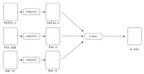

# CS100 Recitation 3 — Week 4

## From Chaofan Li

---

# Join the QQ Group for Open Discussions

Please note that your primary platform for asking questions should be **Piazza**.

<style>
img[alt~="center"] {
  display: block;
  margin: 0 auto;
}
</style>


---

# Contents

- **Control Flow**(控制流)
  - Conditional statements, loops
- **Preprocessor Directives**（预处理指令)
  - `#include`, `#define`
- **Variables**
- **Pointers and Arrays**

---

# Control Flow

- Conditional Statements（条件语句）
- Loops

---

# Control Flow: Conditional Statements
  - `if`, `if`- `else`, `if`-`else if`, nested(嵌套)-`if`
  - `switch`-`case`

---

# Conditional Statements

<style>
img[alt~="center"] {
  display: block;
  margin: 0 auto;
}
</style>


---

# Conditional Statement: `if`-`else`

<div class="columns">
<div class="columns-left">

**Syntax:** `if (condition) statementT else statementF`

- **`condition`**: An **expression** of scalar types (either arithmetic or pointer types).
  - [Arithmetic types](https://en.cppreference.com/w/c/language/arithmetic_types): Integer and floating-point types.
    - Example: `if (a > 0)`
  - [Pointer types](https://en.cppreference.com/w/c/language/pointer): Pointers to objects, functions, etc.
    - Example: `if (ptr) {...}` is equivalent to `if (ptr != NULL)`.

</div>
<div class="columns-right">


</div>
</div>

---

# Exercise 1

<div class="columns">
<div class="columns-left">

```c
#include <stdio.h>

int i;

int main() {
    if (i) {
        // Do nothing
    } else {
        printf("Else");
    }
    return 0;
}
```

</div>
<div class="columns-right">

**Question: What is correct about the above program?**

-  `if` block is executed.

- `else` block is executed. 

- It is unpredictable as `i` is not initialized.

- Error: misplaced `else`.

</div>
</div>


---

# Conditional Statement: `switch`-`case`

<div class="columns">
<div class="columns-left">

Syntax: 
```c
switch (expression)
{
    case constant1:
      // statements
      break;

    case constant2:
      // statements
      break;
    .
    .
    .
    default:
      // default statements
}
```

</div>
<div class="columns-right">

- **`expression`**: Any expression of integer type (char, signed or unsigned integer, or enumeration)
- **Expression in a `case` label**: An [integer constant expression](https://en.cppreference.com/w/c/language/)
  - [integer constants](https://en.cppreference.com/w/c/language/integer_constant): `42`
  - [character constants](https://en.cppreference.com/w/c/language/character_constant): `a`
  - `true`, ...

- The expression's value is known at compile time.

</div>
</div>

---

<div class="columns">
<div class="columns-left">

<br><br>

# `switch`-`case`: Control Flow（控制流）
Once control flow jumps to the statement corresponding to a `case` label, it continues to **execute downwards until** a `break;` is encountered or the end of the `switch` block is reached.
- The control flow will **NOT** stop if there isn't a `break;` before the next `case`.

</div>
<div class="columns-right">


</div>
</div>

---

# Exercise 2: What the output of the following program?
```c
#include <stdio.h>
 
void func(int x){
   printf("func(%d): ", x);
   switch(x){
      case 1: printf("case 1, ");
      case 2: printf("case 2, ");
      case 3: printf("case 3.\n"); break;
      case 4: printf("case 4, ");
      case 5:
      case 6: printf("case 5 or case 6, ");
      default: printf("default.\n");
   }
}
 
int main(void){
   for(int i = 1; i < 9; ++i) func(i);
}
```
---

# Exercise 2

Output:
```
func(1): case 1, case 2, case 3.
func(2): case 2, case 3.
func(3): case 3.
func(4): case 4, case 5 or case 6, default.
func(5): case 5 or case 6, default.
func(6): case 5 or case 6, default.
func(7): default.
func(8): default.
```
---

# `switch`-`case`: Scope (作用域) - [Block Scope](https://en.cppreference.com/w/c/language/scope)

- Established by `if`, `switch`, `for`, `while`, `do-while`, function definitions, etc.
- The scope begins at the point of declaration and ends at the end of the block or statement where it was declared.
- Usually, the block is marked by `{}`.

---
# Scope (作用域)--the block is maked by {}
```c
#include <stdio.h>
int main(void)
{
    {
        int x = 1;
    }
    printf("%d", x);
    return 0;
}
```
---
# Scope (作用域)--the block is maked by {}
```c
#include <stdio.h>
int main(void)
{
    {
        int x = 1;
    }
    printf("%d", x);
    return 0;
}
```
heaticy@heaticy-ThinkStation-P320 ~/CS100 (master) [1]> gcc a.c -o a.out
a.c: In function ‘main’:
a.c:7:18: error: ‘x’ undeclared (first use in this function)
    7 |     printf("%d", x);
      |                  ^
a.c:7:18: note: each undeclared identifier is reported only once for each function it appears in


---

# `switch`-`case`: Scope

```c
switch (expr) {
  case 1: 
    int x = 42;
    do_something(x, expr);
  case 2:
    printf("%d\n", x); 
}
```

- What happens if `expr` evaluates to `2`?

---

# `switch`-`case`: Scope

```c
switch (expr) {
  case 1: { // Use {} to limit `x` to this block.
    int x = 42;
    do_something(x, expr);
  }
  case 2:
    printf("%d\n", x); // Error: `x` is not declared in this scope.
}
```

- If `expr == 2`, the control flow skips `int x = 42;`, but `x` is still visible due to name lookup rules.
  - The declaration of `x` is still in the `switch` scope, because it’s in the `{}` block.
  
- To avoid this, variables declared inside a `case` should be placed in their own block.
  - In short, use `{}` to limit the scope.

---

# Exercise 3

<div class="columns">
<div class="columns-left">

```c
# include <stdio.h>
int main(void){
  int i = 0;
  for (i = 0; i < 20; i++){
    switch(i){
      case 0:
        i += 5; 
      case 1:
        i += 2;
      case 5:
        i += 5;
      default:
        i += 4;
        break;
    }
    printf("%d\n", i);
  }
  return 0;
}
```

</div>
<div class="columns-right">

**Question: What is the output?**

- 5 10 15 20

- 7 12 17 22

- 16 21

- Compile Error

</div>
</div>

---

# Control Flow: Loops
- `while`
- `for`
- `do` - `while`

---

# Loops

<style>
img[alt~="center"] {
  display: block;
  margin: 0 auto;
}
</style>


---

# Entry-controlled Loop: `while`

<style>
img[alt~="center"] {
  display: block;
  margin: 0 auto;
}
</style>


---

<div class="columns">
<div class="columns-left">

# Entry-controlled Loop: `for`


- `init_clause`: **expression**/declaration
- `expression`: same to `while`
- `for(;;){...}` = `while(1){...}`

</div>
<div class="columns-right">


</div>
</div>

---

# Exercise 4

```c
#include <stdio.h>

int main(void){
    int i = 1024;
    for (; i; i >>= 1)
        printf("CS100 is easy if you work hard.\n");
    return 0;
}
```

**Question: How many times will `CS100 is easy if you work hard.` be printed in the above program?**

---

# Exercise 5

<div class="columns">
<div class="columns-left">

```c
#include <stdio.h>
int main(void){
   int n;
   for (n = 9; n != 0; n--)
     printf("n = %d\n", n--);
   return 0;
}
```

</div>

<div class="columns-right">

**Question: What is the output?**

- 9 7 5 3 1

- 9 8 7 6 5 4 3 2 1

- Infinite loop

- 9 7 5 3

</div>
</div>


---

# Exit-controlled Loop: `do`-`while`

<style>
img[alt~="center"] {
  display: block;
  margin: 0 auto;
}
</style>


- The loop body is always executed ***at least once***.

---

# Exercise 6

<div class="columns">
<div class="columns-left">

```c
#include <stdio.h>
int main(void){
   int c = 5, n = 10000;
   do{
    n /= c;
   } while(c--);

   printf("%d\n", n);
   return 0;
}
```

</div>
<div class="columns-right">

Question: What is the output?

A) 1

B) Runtime Error

C) 0

D) Compile Error

E) Undefined Behavior

</div>
</div>

---


# Preprocessor Directives（预处理指令）
- Preprocessor
- Preprocessor Directives

---

# Preprocessor & **Preprocessor Directives**

- When compiling a C/C++ program, the compiler first calls the **preprocessor** to handle all preprocessor directives.
  - Sometimes the preprocessor is considered part of the compiler.
- The **preprocessing directives** control the behavior of the preprocessor.

<style>
img[alt~="center"] {
  display: block;
  margin: 0 auto;
}
</style>


---

# Exercise 7: Try the following commands.

<div class="columns">
<div class="columns-left">

- `gcc a.c --save-temps`

  - Store the intermediate files permanently.

- `gcc a.c -E`: [GCC Options](https://gcc.gnu.org/onlinedocs/gcc-9.2.0/gcc/Developer-Options.html)

  - `-E`tells GCC to stop after the preprocessing stage.

  - It outputs the preprocessed source code to your console.

</div>
<div class="columns-right">


</div>
</div>

---

# Preprocessor Directives  - Control the preprocessor

**Examples:**

- **Source file inclusion**: `#include`

- **Replacing text macros（宏）**: `#define`, *`#undef`(cancels a previous definition by `#define`)

  - **Macro**: a piece of code in a program that is replaced by the value of the macro

- **Conditional inclusion**: `#if`, `#ifdef`, `#ifnef`, `#else`, etc.

- \*Implementation defined behavior control: `#pragma`

- \*Filename and line information: `#line`, \*Diagnostic directives: `#error`, etc.

---

# Source File Inclusion: `#include`

**Syntax**:
```c
#include <filename> (newline)
#include "filename" (newline)
```

The `#include` directive is used for **text replacement** in C programming. It locates the specified file and **inserts its contents into the source file** at the point where the directive appears, following the **rules** *provided on the next page*.

- **Difference between `#include` and `import`**:  
The **`import`** statement is found in other programming languages, such as Python and Java, and is used to include modules or packages. It often includes additional features like namespace management and module loading. **C++ has included support for [modules](https://en.cppreference.com/w/cpp/language/modules) since the C++20 standard**.

---

## Search Path of `#include`
- **`#include <file>`**: This form is typically used for standard library headers.
  - **Default behavior (of the GCC preprocessor)**: It searches only in standard system directories, which are preconfigured and may vary depending on the system and GCC configuration.
  - **Command-line options** can be utilized to add additional directories to the search path. The most commonly used option is `-Idir`, which can be specified as follows: `gcc a.c -o a -I/home/liuxiao/my_awesome_library/include`

- **`#include "file"`**: This form is commonly used for user-defined headers.
  - The preprocessor first searches in the directory of the current file, treating the file as a **relative path**, and then continues to search in the standard system directories.  
  - Example: `#include "../my_library/include/my_header.h"`

--- 

# **Replacing text** macros: `#define`

```c
#define N 1000
#define MAX(A, B) A < B ? B : A
```

After this, all occurrences of `N` will be replaced with `1000`, and all occurrences of `MAX(expr1, expr2)` will be replaced with `expr1 < expr2 ? expr2 : expr1`.

- The form `#define MACRO_NAME text_to_be_replaced` is called **object-like macro**. It replaces every occurrence of a defined `MACRO_NAME` with `text_to_be_replaced`. 
- The other form `#define MACRO_NAME (parameters, ...) text_to_be_replaced` is called **function-like macro**. 

Note: **Redefining** a macro previously defined is not legal, unless the new definition is precisely the same as the old. This means that ***two files***, each with a definition of a certain macro, ***must be consistent in that definition***.

---

# `#undef`
The `#undef` directive has the following syntax:
```c
#undef MACRO_NAME
```

This directive cancels a previous definition of the identifier by `#define` . 

---

<div class="columns">
<div class="columns-left">

# `#define`: Scope

- A macro is **active** from the point of its `#define` directive.

- It becomes **inactive** when it reaches a corresponding `#undef` directive or the end of the current file.


</div>

<div class="columns-right">

```c
#include <stdio.h>

#define APPLE (10 + PEAR)

int main(void){
#define PEAR 15
    int x = APPLE;
    printf("x is %d.\n", x); 
    // x is 25.
#undef PEAR

#define PEAR 100
    int y = APPLE;
    printf("y is %d.\n", y);
    // y is 110.
}
```

</div>
</div>

---

# `#define`: Nested Definitions

<div class="columns">
<div class="columns-left">

<br/>

1) If a macro’s name appears in its own replacement text, it is **not replaced**. 

2) These non-replaced macro names will then be **unavailable for further replacements**.

</div>
<div class="columns-right">

```c
#include <stdio.h>

#define APPLE (10 + APPLE)  // 1)

void foo(void){
  int y = APPLE;  // 2) 
  // y is undeclared; error
#undef APPLE
#define APPLE 15
}

int main(void){
    int x = APPLE;
    printf("x is %d.\n", x);
    // x is 15 if '2)' is commented out.
}
```

</div>
</div>

---

<div class="columns">
<div class="columns-left">

<br/>

# `#define`: Function-Like Form

Recap: In the first slide on `#define`, we introduced the function-like macro `MAX(A, B)`:

```c
#define MAX(A, B) A < B ? B : A
```

</div>

<div class="columns-right">

```c
#include <stdio.h>

// Macro definition
#define AREA(l, b) (l * b)

int main(void){
  // Given lengths l1 and l2
  int l1 = 10, l2 = 5, area;

  // Find the area using macros
  area = AREA(l1, l2);

  // Print the area
  printf("%d\n", area);

  return 0;
}
```

</div>

</div>

---

# Exercise 8

Given the following usage, evaluate if our macro definition is correct. What potential problems can you identify, and how can we address them?
```c
#define MAX(A, B) A < B ? B : A

int i = 10, j = 15;
int k = MAX(i, j) + 1;
```

- What about this definition? `#define MAX(A, B) (A < B ? B : A)`
  - Hint: Evaluate the result of `MAX(i, i & j)`.
- What about this definition? `#define MAX(A, B) ((A) < (B) ? (B) : (A))`
  - Hint: Again, try with `MAX(i, ++j)`.
  
---

# `#define`: Function-Like Form 

## **Key Takeaway:**
- Always use **parentheses** around **macro arguments** and **the entire macro** to prevent unexpected behaviors.
- Do **NOT** use `#define` to replace functions.

---

# Conditional Inclusion: `#ifdef`, `#ifndef`, `#endif`

<div class="columns">
<div class="columns-left">

```c
#ifdef MACRO_NAME
  // Text block
#endif
```

</div>

<div class="columns-right">

```c
#ifndef MACRO_NAME
  // Text block
#endif
```

</div>
</div>

- The `#ifdef` (or `#ifndef`) directives, along with `#endif`, form a block of text. These directives should be placed within a file and must appear in pairs.
- Whether the text block is included in the compiler's input depends on the definition of `MACRO_NAME`:
  - If `MACRO_NAME` is defined with `#define`, the text between `#ifdef` and `#endif` will be included. Otherwise, it will be excluded.
  - The `#ifndef` directive works in the opposite manner.

--- 

# Conditional inclusion: `#if`, `#elif`, `#else`, `#endif`

<div class="columns">
<div class="columns-left">

- One and only one text block of the 3 block`Text block 1`, `Text block 2`*(optional)*, `Text block 3`*(optional)* will be included due to the `macro_condition`'s value. 

- `expression` is a constant expression using only constants and identifiers, defined using `#define` directives.

</div>
<div class="columns-right">

```c
#if macro_condition
   // Text block 1
#elif macro_condition
   // Text block 2
#else
   // Text block 3
#endif
```

</div>
</div>

- `#ifdef identifier` is essentially equivalent to `#if defined identifier`.
- `#ifndef identifier` is essentially equivalent to `#if !defined identifier`.

---

# Example


<div style="display: grid; grid-template-columns: 1fr 1fr;">
  <div>

```c
#define ABCD 2
#include <stdio.h>
 
int main(void){

#ifdef ABCD
  printf("1: yes\n");   // printed

#else
  printf("1: no\n");

#endif
```
  </div>
  <div>

```c
#ifndef ABCD
  printf("2: no1\n");

#elif ABCD == 2         // printed 
  printf("2: yes\n");

#else
  printf("2: no2\n");   
#endif
 
#if !defined(DCBA) && (ABCD < 2 * 4 - 3)
  printf("3: yes\n");   // printed
#endif
}
```
  </div>
</div>

---

# Header Guards
- If you happen to include one header twice in your source file, like
  ```c
  #include "my_header.h`
  #include "my_header.h`
  ```
  the consequence is diasterous: All the definitions in `my_header.h` (variables/functions) wiil appear twice which will make the program elaspsd.
- You may think it will never happen, but do NOT forget you can nest any layers of header files. So do stardard libraries do. How they prevent the above crashes?

  - Add header guards. It's also suggested to do this in all your header files.
    ```c
    #ifndef HEADER_GUARDS
    #define HEADER_GUARDS
    #endif  // HEADER_GUARDS
    ```


---

# Variables
- Scope and Lifetime
  - Storage duration
- Linkage
  - `static` keyword 
  - `extern` keyword
- Implicit initialization

--- 

# Prerequisite: Translation Unit (Compilation Unit)

<div class="columns">
<div class="columns-left">

- In C and C++ programming terminology, a translation unit is the final **input** to a **C or C++ compiler**, from which an object file is generated.
- A translation unit typically consists of a source file that has been *processed by the C preprocessor*.
  

</div>
<div class="columns-right">




</div>
</div>


- This means header files have been included, conditional sections (e.g., those controlled by `#ifndef`) have been resolved, and macros have been expanded.

---

# Scope and Lifetime

- **Scope**: The section of **code** where a variable is accessible.
  - Each [identifier（标识符）](https://en.cppreference.com/w/c/language/identifier) that appears in a C program is visible (that is, may be used) only in some possibly discontiguous portion of the source code.

- **Lifetime($\approx$ storage duration)**: The **time duration** during program execution when an ***object*** is valid (exists, has a constant address, retains its last-stored value) and can be used.
  - Accessing an object outside of its lifetime results in **undefined behavior**.

--- 

# Example: Static local variable inside a function

<div class="columns">
<div class="columns-left">

```c
#include <stdio.h>
void count_calls(void) {
    // static local variable
    static int count = 0;  
    count++;
    printf("%d times\n", count);
}
int main(void) {
    count_calls();  // First call
    count_calls();  // Second call
    count_calls();  // Third call
    return 0;
}
```
```
called 1 times
called 2 times
called 3 times
```


</div>
<div class="columns-right">

- Scope:
The `count` variable is declared inside the `count_calls()` function, so its scope is limited to this function. It cannot be accessed or modified directly outside of this function.

- Lifetime:
The lifetime of the static variable `count` begins when the program starts, and it remains in memory until the program terminates. Its value persists between function calls.

</div>
</div>


---

# Example: Accessing an object outside of its **lifetime**

```c
int* dangling_pointer(void) {
    int x = 5;  /
    return &x; 
}

int main(void) {
    int *ptr = dangling_pointer();  
    // ptr points to a local variable that no longer exists
    printf("%d\n", *ptr);  
    // Undefined behavior: accessing a variable after its lifetime
    return 0;
}
```

The behavior to access the return value of `dangling_pointer()` in the `main` function is **undefined** since the variable `x`'s lifetime has ended before the `dangling_pointer` return to its caller `main`.


--- 

# Example: Accessing an object outside of its **scope**


<div class="columns">
<div class="columns-left">

- Example 1: Accessing global variable in a function while the varibale is not in the local scope of the function.

```c
#include <stdio.h>

int global_x = 42;

void foo(void) {
  // local scope of foo() begins
  printf("%d\n", global_x);  
}

int main(void) {
  foo(); 
  return 0;
}
```

</div>
<div class="columns-right">

- Example 2: Accessing variable outside its scope through pointer.
```c
#include <stdio.h>

void modify_value(int *ptr) {
  *ptr = 20;
  printf("%d\n", *ptr);
}

int main(void) {
  int x = 10;  
  modify_value(&x);

  printf("%d\n", x);

  return 0;
}
```
</div>
</div>


---

# Scope

**When scopes overlap, the declaration in the inner scope **hides** the declaration from the outer scope.**

- **Block scope**: Applies to function bodies, `if`, `switch`, `for`, `while`, `do-while` statements, and the parameter list of a function definition.
  - Begins at the point of declaration and ends at the end of the block or statement where it was declared.
- **File scope**: Applies to identifiers declared outside of any block or parameter list.
  - Begins at the point of declaration and ends at the end of **the translation unit**.
- **\*Function prototype scope**: `int f(int n, int a[n]);`
Refers to a name introduced in the parameter list of a function declaration (not definition).
  - Ends at the end of the function [declarator](https://en.cppreference.com/w/c/language/declarations).
- ***\*Function scope***, ***\*Point of declaration***: Beyond the class’s scope.


---

# Variables: Nested Scopes

```c
int a;   // file scope of name a begins here
 
void f(void){
  int a = 1; // the block scope of the name a begins here; 
              // hides file-scope a
  {
    int a = 2;         
    // the scope of the inner a begins here, outer a is hidden
    printf("%d\n", a);  // inner a is in scope, prints 2
  } // the block scope of the inner a ends here

  printf("%d\n", a);    // the outer a is in scope, prints 1

} // the scope of the outer a ends here

void g(int a);   
// name a has function prototype scope; hides file-scope a;
// a is just a placeholder and is not accessible outside the prototype
```
---

# Storage duration - limiting the object **lifetime**

- **automatic storage duration**: exist only at certain points during execution
  - Applies to function parameters, non-`static` block-scope objects, etc.
  - Storage is allocated when the block where the object was decalred is entered and deallocated when it is exited
- **static storage duration**:  have entire program life duration
  - The storage duration is the entire execution of the program.
  - The value stored in the object is initialized **only once**, prior to main function.
  - Applies to all objects declared `static`, etc.
- **allocated storage duration**: have a lifetime determined by the programmer
  - Allocated and deallocated by request(dynamic memory allocation functions).
- **\*thread storage duration**: *beyond the class's scope*

---

# Scope and Storage duration

<div align="center">

| Type                     | Example                          | Scope | Duration  | 
| ------------------------ | -------------------------------- | ----- | --------- |
| Local variable           | `int x;`                         | Block | Automatic |
| Static local variable    | `static int s_x;`                | Block | Static    |
| Function parameter       | `void foo(int x)`                | Block | Automatic |
| Internal global variable | `static int g_x;`                | File  | Static    |
| External global variable | `int g_x;`                       | File  | Static    |

</div>

---

# Linkage: **the ability to be referenced** in other scope

Linkage refers to **the ability of an identifier** (variable or function) to be referenced **in other scopes**. The following types of linkage are recognized:

- **No linkage**: The identifier can only be referenced **from within its own scope**.
  - Applies to all function parameters and all non-`extern` block-scope variables (including the ones declared `static`).
  
- **Internal linkage**: The identifier can be referenced **within the current translation unit**.
  - Applies to all `static` **file-scope** identifiers (both functions and variables).

- **External linkage**: The identifier can be referenced **from any other translation units**.
  - Applies to all non-`static` functions, all `extern` variables (unless earlier declared `static`), and all file-scope non-`static` variables.

---

<div class="columns">
  <div class="columns-left">

# Linkage

- In a C program with multiple source files, each file is compiled one at a time and linked into a single executable.
- Until the compilation process, the scope of a variable defines its visibility and accessibility.
  - The compiler utilizes the property of scope

  </div>
  <div class="columns-right">

  

  </div>
</div>

- It is during the linking process that the linkage property comes into play:
  - Should a variable be accessible for use in another file?
  - Should a variable be restricted to use only within the file it was declared?

---

# Scope, Storage duration and Linkage

<div align="center">

| Type                     | Example                          | Scope | Duration  | Linkage  | 
| ------------------------ | -------------------------------- | ----- | --------- | -------- |
| Local variable           | `int x;`                         | Block | Automatic | None     |
| Static local variable    | `static int s_x;`                | Block | Static    | None     |
| Function parameter       | `void foo(int x)`                | Block | Automatic | None     |
| Internal global variable | `static int g_x;`                | File  | Static    | Internal |
| External global variable | `int g_x;`                       | File  | Static    | External |

</div>

---

# Scope, Storage duration and Linkage

- All objects with either internal or external linkage have static sotrage duration.
- Block-scope variables have no linkage and automatic storage duration by default. 
  - Storage duration for local variables begins when the block is entered, but until the declaration is seen, the variable is not in scope and cannot be accessed.
- File-scope identifiers have external linkage and static storage duration by default.
  - How are these identifiers referred to from other translation units, given that their scopes are only within their own translation unit?
  > CppReference:
  If a variable or function with the same **identifier** is declared in several scopes, but cannot be referred to from all of them, then **several instances of the variable are generated**.


---

## Internal Linkage: `static` Keyword

<div class="columns">
<div class="columns-left">

- For block-scope variables,
  - grant them static storage duration
  - ensure them to be initialized once

```c
#include <stdio.h>

void counter() {
  static int count = 0; 
  count++;
  printf("%d\n", count);
}

int main(void) {
  counter();  // Output: 1
  counter();  // Output: 2
  counter();  // Output: 3
  return 0;
}
```

</div>
<div class="columns-right">

- For file-scope identifiers (both functions and variables),
  - grant them static storage duration
  - grant them internal linkage

```c
#include <stdio.h>

// File-scope static variable
static int file_scope_var = 42;  

// File-scope static function
static void file_scope_function(void){  
  printf("%d\n", file_scope_var);
}

int main(void){
  file_scope_function();
  return 0;
}
```
</div>
</div>

---

# External Linkage: `extern` keyword
The extern specifier specifies **static storage duration** and **external linkage**. It can be used with function and object ***declarations*** in **both file and block scope**.

---

<div class="columns">
<div class="columns-left">

# Example 1 of `extern`

File1: `file1.c`

```c
#include <stdio.h>

// Definition of a global variable
int shared_variable = 42;  

void display_variable(void) {
  printf("%d\n", shared_variable);
}
```

- In `file1.c`, `shared_variable` is defined as a global variable.
- In `file2.c`, we declare it using extern, which allows us to access and modify `shared_variable` from `file1.c`.

</div>

<div class="columns-right">

File2: `file2.c`

```c
#include <stdio.h>

extern int shared_variable;  
void display_variable(void);

void modify_variable(void) {
  // Modifying the external variable
  shared_variable = 100; 
}

int main(void) {
  modify_variable();  
  printf("%d\n", shared_variable);
  return 0;
}
```
Output:
```
42
100
```
</div>
</div>

---

# Example 2 of `extern`

<div class="columns">
<div class="columns-left">

File1: `file1.c`

```c
#include <stdio.h>

// Definition of a global variable
int shared_variable = 42;

void function_with_extern() {
  // Declaration within block scope
  extern int shared_variable;
  // Block scope access
  printf("%d\n", shared_variable);
}
```

</div>

<div class="columns-right">

File2: `file2.c`

```c
// Declaration of the external variable
extern int shared_variable;
void function_with_extern(void);

int main() {
  // accesses the variable
  function_with_extern();
  return 0;
}
```
Output: `42`.

</div>
</div>

<br>

- `extern` can also be used to declrations of block scope.

---

<div class="columns">
<div class="columns-left">

# Example 3 of `extern`

File1: `file1.c`

```c
#include <stdio.h>

static int shared_variable = 42;

void display_variable(void) {
  printf("%d\n", shared_variable);
}
```

</div>

<div class="columns-right">

File2: `file2.c`

```c
extern int shared_variable;
void display_variable(void);

void modify_variable(void) {
  shared_variable = 100;
}

int main(void) {
  modify_variable();
  return 0;
}
```

</div>
</div>

```
 error: linker failed; symbol(s) not found.
```
 - **If extern appears on a redeclaration of an identifier that was already declared with internal linkage, the linkage remains internal.** Otherwise (if the prior declaration was external, no-linkage, or is not in scope), the linkage is external.

 --- 

# Variables: Implicit Initialization

If a variable is declared without explicit initialization:

- Ojects **with automatic storage duration** (e.g., local non-`static` variables) are initialized to **indeterminate values**. In other words, they are **uninitialized**.
- For objects with static storage duration(e.g., global or local `static` variables), they are [**empty-initialized**](https://en.cppreference.com/w/c/language/initialization#Empty_initialization) (called [zero-initialization](https://en.cppreference.com/w/cpp/language/zero_initialization) in C++):
  - **Pointers are initialized to *null pointer values* of their types.**
  - Objects of integral types are initialized to `0`.
  - Objects of floating types are initialized to positive zero (`0.0`).
  - All elements of arrays, all members of structs, and the first members of unions are empty-initialized, recursively, plus all padding bits are initialized to zero.
  
---

# Exercise 9
### Read the following code segments. Tell whether it can compile or not, if can, what's the output?

---

<div class="columns">
<div class="columns-left">

# Exercise 9.1

```c
#include <stdio.h>

int main(void){
  n += 5;
  printf("%d\n", n);

  return 0;
}  
```

</div>
<div class="columns-right">

# Exercise 9.2

```c
#include <stdio.h>

int n = 0;

int main(void) {
  n += 5;
  printf("%d\n", n);

  return 0;
}
```

</div>
</div>

---

<div class="columns">
<div class="columns-left">

# Exercise 9.3

```c
#include <stdio.h>

int n = 0;

int main(void) {
  int n;
  n += 5;

  printf("%d\n", n);

  return 0;
}
```

</div>
<div class="columns-right">

# Exercise 9.4

```c
#include <stdio.h>

int n = 0;

int main(void){
  int n = 1;

  n += 5;
  printf("%d\n", n);

  return 0;
}
```

</div>
</div>

---

<div class="columns">
<div class="columns-left">

# Exercise 9.5

```c
#include <stdio.h>

int n = 0;

int main(void) {
  extern int n;

  n += 5;
  printf("%d\n", n);

  return 0;
}
```

</div>
<div class="columns-right">

# Exercise 9.6

```c
#include <stdio.h>

int total(int x) {
  static int total = 0;

  total += x;
  return total;
}

int main(void) {
  total(5);
  total(10);
  printf("%d\n", total(15));
  return 0;
}
```

</div>
</div>

---

# Exercise 9.7

<div class="columns">
<div class="columns-left">

`library.h`:
```c
#ifndef LIBRARY_H
#define LIBRARY_H

int net_price(int price, int discount);
static int validate(int n);

#endif
```

`driver.c`: 
```c
#include "library.h"
int main(void) {
  int i, j;
  i = validate(-5);
  j = net_price(6, 2);
}
```

</div>

<div class="columns-right">


`library.c`:

```c
#include "library.h"

int net_price(int price, int discount) {
  return validate(price - discount);
}

static int validate(int n) {
  if (n < 0) 
    return 0;
  else       
    return n;
}
```
</div>
</div>

---

# Exercise 10
### Identify whether the header files and source files can separately be compiled. If can, can they link together?

---

# Exercise 10.1

<div class="columns">
<div class="columns-left">

`account.h`:
```c
#ifndef ACCOUNT_H
#define ACCOUNT_H

#define ACCT_OK      0
#define ACCT_INVALID 1
#define ACCT_CLOSED  2

int acct_status;

#endif
```

</div>

<div class="columns-right">

`account.c`:

```c
#include "account.h"

// Use acct_status
```

`driver.c`:

```c
#include "account.h"

// Use acct_status
```

</div>
</div>

---

# Exercise 10.2

<div class="columns">
<div class="columns-left">

`account.h`:
```c
#ifndef ACCOUNT_H
#define ACCOUNT_H

#define ACCT_OK      0
#define ACCT_INVALID 1
#define ACCT_CLOSED  2

// Don't define acct_status
// since that caused the problem

#endif
```

</div>

<div class="columns-right">

`account.c`:

```c
#include "account.h"

// Use acct_status

```

`driver.c`:

```c
#include "account.h"

// Use acct_status

```

</div>
</div>

---

# Exercise 10.3

<div class="columns">
<div class="columns-left">

`account.h`:
```c
#ifndef ACCOUNT_H
#define ACCOUNT_H

#define ACCT_OK      0
#define ACCT_INVALID 1
#define ACCT_CLOSED  2

// Don't define acct_status

#endif
```

</div>

<div class="columns-right">

`account.c`:

```c
#include "account.h"

int acct_status;

// Use acct_status
```

`driver.c`:

```c
#include "account.h"

// Use acct_status

```

</div>
</div>

---

# Exercise 10.4

<div class="columns">
<div class="columns-left">

`account.h`:
```c
#ifndef ACCOUNT_H
#define ACCOUNT_H

#define ACCT_OK      0
#define ACCT_INVALID 1
#define ACCT_CLOSED  2

extern int acct_status;

#endif
```

</div>

<div class="columns-right">

`account.c`:

```c
#include "account.h"

// Use acct_status
```

`driver.c`:

```c
#include "account.h"

// Use acct_status
```

</div>
</div>

---

# Exercise 10.5

<div class="columns">
<div class="columns-left">

`account.h`:
```c
#ifndef ACCOUNT_H
#define ACCOUNT_H

#define ACCT_OK      0
#define ACCT_INVALID 1
#define ACCT_CLOSED  2

extern int acct_status;

#endif
```

</div>

<div class="columns-right">

`account.c`:

```c
#include "account.h"

int acct_status = ACCT_OK;

// Use acct_status
```

`driver.c`:

```c
#include "account.h"

// Use acct_status
```

</div>
</div>

---

# Pointer and Arrays
### Review the lecture slides.

---

# CS100 Recitation 3 — Week 4


## From Chaofan Li