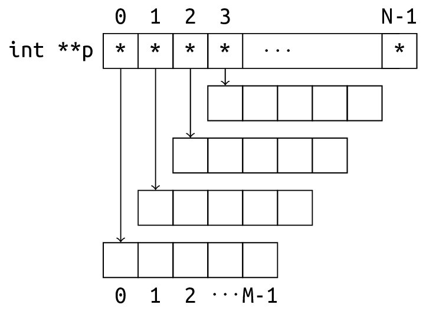

# CS100 Recitation 4 — Week 5

## From Chaofan Li

---

# Contents

<div class="columns">
<div class="columns-left">

- **Pointers**
  - **Pointer Types**
  - **Null Pointers and **Null Pointer Values****
  - **Undefined Dereferencing**
  - **`[]` Operator**
  - **`const` Qualification**
- **Arrays**
  - **Variable-Length Array (VLA)**
  - **Array to Pointer Conversion**

</div>
<div class="columns-right">

- **C-Style Strings**
  - **String I/O**
  - **C Strings Library**
- **Dynamic Memory Management**
  - **`malloc`, `calloc`, `realloc` and `free`**
  - **In-Class Examples**
 
</div>
</div>

---

# Pointers
- **Pointer Types**
- **Null Pointers and **Null Pointer Values****
- **Undefined Dereferencing**
- **`[]` Operator**
- **`const` Qualification**

---

# Pointer Types

- **Basics**
- **Legal pointer type conversion**
- **Pointer aliasing**
  - **Strict aliasing**
- **`void *`**

---

# Pointer Types

- The type of a pointer is `PointeeType *`.
- For two different types `T1` and `T2`, the pointer types `T1 *` and `T2 *` are **different types**, although they may point to the same location.
  ```c
  int i = 42;
  float *fp = &i;
  ++*fp; // Undefined behavior. It is not ++i.
  ```
- In C, pointers of different types can be implicitly converted to each other (with possibly a warning). This is **extremely unsafe** and an error in C++.


---

# Pointer Types: Legal Pointer Type Cconversion

Dereferencing a pointer of type `T1 *` when it is actually pointing to a `T2` ***is *almost always* undefined behavior***, **unless**:

- `T2` and `T1` are ***compatible types**(sufficiently similar types)*. 

  ```c
  int x = 1; int *p = &x; printf("%d\n", *p); 
  // *p is lvalue expression of int type; compatible with (same as) int
  ```

- `T2` is const, volatile(兼容), or restrict-qualified(限制/约束) version of a type that is compatible with `T1`.

  ```c
  int x = 1; const int *p = &x; printf("%d\n", *p); 
  ```

- `T2` is a signed or unsigned version of a type that is compatible with `T1`.

  ```c
  int x = 1; unsigned int *p = (unsigned int*)&x; printf("%u\n", *p ); 
  ```

---

# Pointer Types: Legal Pointer Type Cconversion (cond.)

- `T2` is a character type (`char`, `signed char`, or `unsigned char`).

  ```c
  int x = 65; char *p = (char *)&x; printf("%c\n", *p);
  ```

- etc.

For further details, refer to [compatible types](https://en.cppreference.com/w/c/language/type#Compatible_types). ***(beyond the scope)***

---

# *Pointer Aliasing（指针别名） - Beyond the Scope*

In C and C++, when multiple pointers point to the same memory region, **aliasing** occurs.
  ```c
  void foo(double* a, double* b, int n) {
      for (int i = 0; i < n; i++) {
          b[i] += a[i];
      }
  }
  ```
- If `a` and `b` point to distinct memory blocks, the code is perfectly parallelizable and can be optimized. 
- However, if we invoke `foo` as `foo(a, a + 1, n - 1);`, the optimization may become problematic.

---

# *Strict Aliasing（严格别名） - Beyond the Scope*

- C/C++ **compilers assume(编译器以为)** that pointers of **different types** will never point to the same memory location, i.e., they are not aliases of each other.
  - The specific details of "different types" are mentioned in the section "Legal Pointer Conversion.(**合法指针转换**)"
  - The strict aliasing rule is enabled by default at optimization level 2 and beyond.
  
- **In short(简言之)**, even if we **never** pass the same pointer to a function, the compiler will not perform some optimizations to ensure correctness if the two parameters of the function could **potentially(潜在)** accept pointer aliases.

---

<div class="columns">
<div class="columns-left">

# Examples: Strict Aliasing

```c
int foo(int* ptr1, int* ptr2){ 
  *ptr1 = 10; 
  *ptr2 = 11; 
  return *ptr1; 
} 
```
</div>
<div class="columns-right">
 
\
The compiler cannot 
optimize the code as shown below since both `ptr1` and `ptr2` could be aliases of each other.

```c 
int foo(int* ptr1, int* ptr2){ 
  *ptr1 = 10; *ptr2 = 11;
  return 10;
} 
```

</div>
</div>

<br/>

<div class="columns">
<div class="columns-left">

```c
int foo(int* ptr1, double* ptr2){ 
    *ptr1 = 10; 
    *ptr2 = 21.02; 
    return *ptr1; 
} 
 
```
</div>
<div class="columns-right">

```c 
int foo(int* ptr1, double* ptr2){ 
  *ptr1 = 10; *ptr2 = 21.02; 
  return 10;
} 
```

In this case, the optimization is correct.

</div>
</div>

- For more information, see [`CppReference - Strict Aliasing`](https://en.cppreference.com/w/c/language/object#Strict_aliasing).


---

# Pointers type: `void *`

A pointer to **object of any type** can be implicitly converted to `void *`, and **vice versa(反之亦然)**.
- The conversion from `void *` to any other pointer type must happen explicitly in C++.

The chaos:

```c
int n = 1
int* p = &n;
void* pv = p; // int* to void*
int* p2 = pv; // void* to int*
```

---

# Pointers type: `void *`

The `void *` type introduces a weakness in the C type system but can be beneficial when passing **objects of unknown type** to functions. Here are some common use cases:

  - [`malloc`](https://en.cppreference.com/w/c/memory/malloc) returns `void *`. The returned pointer should be suitable for any object type. 
    - Additionally, you shouldn't cast the result of `malloc`. See [StackOverflow](https://stackoverflow.com/a/605858).
    - Use `int* p = malloc(size);` instead of `int* p = (int *)malloc(size);`
  - [`qsort`](https://en.cppreference.com/w/c/algorithm/qsort) expects a user-provided callback that accepts two `const void*` arguments.
    - `void qsort( void* ptr, size_t count, size_t size, int (*comp)(const void*, const void*));`
  - *\*[`pthread_create`](http://pubs.opengroup.org/onlinepubs/9699919799/functions/pthread_create.html) expects a user-provided callback that accepts and returns `void *`.*

---

# Null Pointers and Null Pointer Values

- **Null pointers**
- **Null pointer values**
- **`NULL`** and  **`nullptr`**

---

# **Null Pointers** and *Null Pointer Value*s

- Null Pointers are pointers that refer to nothing.
- A null pointer compares unequal to any pointer pointing to an **object**.
- Initialization or assignment: using a null pointer constant (value).

**Usage:**

- Indicate the absence of an object.
- Indicate other types of **error conditions**; for example, `malloc` returns a null pointer if the allocation fails.
  <div class="columns">
  <div class="columns-left">

  ```c
  int* ptr = malloc(sizeof(int));
  if (ptr == NULL){ // if(!ptr)
    printf("Allocation failed\n");
  }
  free(ptr);
  ```
  </div>
  <div class="columns-right">

  In general, a function that receives a pointer argument almost always needs to **check if the value is null** and **handle that case differently.**
  </div>
  </div>

---

# Null Pointers and ***Null Pointer Value*s**

- *Null pointer value*s are **"zero" values** for pointer types.
- Pointers of every type have a special value known as **null pointer value of that type**.
- Two null pointer values compare equal, which is defined by [comparison operators](https://en.cppreference.com/w/c/language/operator_comparison).


**Categories of null pointer constants:**

- [`NULL`](https://en.cppreference.com/w/c/types/NULL): The macro is is available from many standard library header files (e.g. `<stddef.h>`, `<stdio.h>`, `<stdlib.h>`)
  ```c
  int* ptr = NULL; 
  ```

- Integer constant with the value zero.
  ```c
  double* ptr_1 = 0;
  double* ptr_2 = 2 - 2;
  ```

---

# **`NULL`** and  **`nullptr`**

- The macro `NULL` is an **implementation-defined** null pointer constant, which may be
  - an integer constant expression with the value `​0​`, e.g., `2 - 2`
  - an integer constant expression with the value `​0​` cast to the type `void *`, e.g. `(void *)0` 0x00000000
  - [since C23] predefined constant [`nullptr`](https://en.cppreference.com/w/c/language/nullptr)

- `nullptr`: **type-safe**
  - of type `nullptr_t`: a distinct type that is not itself a pointer type; has only one valid value, i.e., `nullptr`
  - can be converted to a pointer types or **bool**; that is, null pointer value of that type or `false` repectively

---

# Examples: **`NULL`** and  **`nullptr`**

Which function will the call `func(NULL)` match?

<div class="columns">
<div class="columns-left">

```c
void func(int a){
    //...
}
```

</div>
<div class="columns-right">

```c
void func(char* ptr){
    //...
}
```

</div>
</div>

- `NULL` is a null pointer **constant** (null pointer value; value of a null pointer), not a **pointer** itself.
- How about `func((void *)0)` or `func((int)ptr)` where `ptr == NULL`? 
  - Using calls like that can be confusing and error-prone for users of the language.
  - To avoid ambiguity(模棱两可), prefer using `nullptr` as a null pointer constant, especially in modern C++ (since C++11) and C (since C23). This ensures type safety and improves code clarity. 

---

# Undefined Dereferencing

---

# Undefined Dereferencing

Attempting to dereference a pointer that does **not point to an actual object** leads to **undefined behavior** and is typically considered a **severe runtime error**. The scenarios in which this may occur include:

- **Null Pointers**
- **Wild (Uninitialized) Pointers**: `int* p;`
- **Dangling Pointers**: Pointers that point to memory that has just been released.
  - Pointers that once pointed to memory allocated by `malloc` but have since been `free`d.
  - Pointers that point to a variable that has gone out of scope, e.g.,
    ```c
    int* foo(int n) { return &n; }
    ```
- **Pointing to Another Invalid or Meaningless Address**: `int* p = (int*)123;`.

---

# Subscript Operator `[]`

---

# Subscript Operator `[]`

**Syntax:**
- Form 1: *pointer-expression* `[` *integer-expression* `]`
- Form 2: *integer-expression* `[` *pointer-expression* `]`

**Definition:** The expression `E1[E2]` is exactly equivalent to `*((E1) + (E2))`.

- If the *pointer-expression* (in either form) is an array expression, it undergoes **implicit array-to-pointer conversion**, resulting in a pointer to the first element of the array.
- The equivalence of `arr[N]` to the N-th element of the array `arr` is a consequence of pointer arithmetic, specifically the addition of a pointer and an integer, in accordance with the definition above.
- For an array defined as `int a[3] = {1, 2, 3};`, the expression `a[2] == 2[a]` evaluates to true.

---

# `const` Qualification

- `const` Semantics

- **Low-level `const`ness of Pointers**

- **Top-level `const`ness of Pointers**

---


# `const` Semantics(语义)

The semantics of the `const` qualifier apply exclusively to *lvalue* expressions, which possess an identity. Such expressions are not modifiable and, in particular, are not **assignable**.
```c
const int n = 1; // object of const-qualified type
n = 2; // error: n is of const-qualified type

int x = 2; // object of unqualified type
const int* p = &x;
*p = 3; // error: the lvalue *p is of const-qualified type

int const ci; // uninitialized
ci = 5; // error: ci is of const-qualified type
```

Objects declared with `const`-qualified types may be placed in **read-only memory** by the compiler. Moreover, if the address of a `const` object is never taken within a program, *the object may not be stored at all*. 

---


# Low-level and Top-level `const`-ness of Pointers
- **Pointer-to-`const`**: Low-level `const` (const qualification applies to the pointed-to object)
  - A pointer to `const` can point to a non-`const` object.
  - A pointer to a non-`const` type can be implicitly converted to a pointer to the `const`-qualified version of the same type. **The reverse conversion, however, requires an explicit cast.**
    ```c
    int n = 42; int* p = &n;
    const int* cp = p; // OK: adding qualifiers (int to const int)
    p = cp; // Error: discarding qualifiers (const int to int)
    p = (int *)cp; // OK: cast
    ```
    **However, using `p` to modify the value of `n` (the object it points to) results in undefined behavior.**
- **`const` pointer**: Top-level `const` (const qualification applies to the pointer itself)
  - In this case, **the pointed-to object is modifiable**, but the pointer itself is not.

---


# Exercise 1

What level of `const`-ness is specified by the following `const`-qualified pointer types?

- `int** const`
- `int* const*`
- `int const**`
- `int* const* const`

---

# Arrays
- **Variable-Length Array (VLA)**
- **`sizeof` Operator**
- **Array to Pointer Conversion**


---

# Variable-Length Array (VLA)

> Arrays of constant known size: `int n[10];`, `char str[] = "abc";`
> ```c
> Type arr[N]; // `N` is a constant expression whose value is known at compile-time.
> ```

If the size of an array is determined at **runtime**, it is a Variable-Length Array (VLA):
```c
int n;
scanf("%d", &n);
int a[n];
```
- The lifetime of a VLA ends when its declaration goes out of scope. 
- Each time the flow of control reaches the declaration, the size expression is evaluated, and the array is allocated. 
- On subsequent executions of the same code, the VLA may be allocated **with a different size**.

---

# Variable-Length Array (VLA)

```c
int n;
scanf("%d", &n);
int a[n];
```

- VLAs were introduced in the C language standard with **C99**, but since **C11**, compilers are no longer required to support them.
- **We do not recommend or permit the use of VLAs**.
  - Instead, you should use `malloc` or `calloc` for dynamic memory allocation.
- During discussions for C++14, the idea of introducing VLAs into C++ was considered but was ultimately **voted out**.
  - For more details, you can refer to [Gkxx's CSDN blog](https://blog.csdn.net/qq_39677783/article/details/129219624?spm=1001.2014.3001.5501).

---

# Array to Pointer Conversion
- **`sizeof` Operator on Arrays** 
- **Decay From Arrays to Pointers**

---

# `sizeof` Operator on Arrays

It is important to emphasize that arrays and pointers are distinct types, ***despite the common conversion from arrays to pointers.***
> Recall that `sizeof` is an operator that returns the size of a type in bytes. The return type of `sizeof(type)` is `size_t`, which is an implementation-defined unsigned integer type.  
> **Note:** For Variable-Length Arrays (VLAs), `sizeof` is calculated at runtime.


### Example:
```c
#include <stdio.h>
int main(void){
    int a[] = {1, 2, 3, 4, 5};
    printf("Size of the array: %zu\n", sizeof(a));
    // 20 (5 elements * 4 bytes each)
    printf("Size of a pointer to the array: %zu\n", sizeof(&a));  // 8
    printf("Size of a pointer to the first element: %zu\n", sizeof(&a[0])); // 8
}
```

---


# Decay From Arrays to Pointers

Decay refers to the implicit conversion of an array to a pointer to its first element. 

- An array of type `Type [N]` decays to a pointer of type `Type *`.
- The expression `p = &arr[0]` can be simplified to `p = arr`.
- The expression `*arr` is equivalent to `*(&arr[0])` or `arr[0]`.

This conversion is defined by the C standard. Any lvalue expression of array type (e.g., the array's identifier/name) undergoes this conversion when used in any context **other than**:

- ***The operand of the address-of operator `&`***
- ***The operand of `sizeof`***
- ***The string literal used for array initialization***
- The operand of `typeof` and `typeof_unqual` (since C23)*** \*[beyond the scope]

In these contexts, the array does **NOT** decay into a pointer.

---

# C-Style Strings
- **String I/O**
- **C Strings Library**

---

# String I/O

- **Error-Prone Input: `scanf`, `gets`**
- **Memory-Safe Input: `fgets`**
- **Output: `puts`**

--- 

# Error-Prone Input: `scanf`, `gets`

- [`scanf`](https://en.cppreference.com/w/c/io/fscanf) / [`printf`](https://en.cppreference.com/w/c/io/fprintf): Using `"%s"`
  - The `scanf` function with the format specifier `"%s"` poses memory safety issues because it accepts only a pointer of type `char *`, leaving the length of the array unspecified.

- `gets`: Reads a string without **bounds checking**.
  - This function has been **removed from the standard since C11**.
  - An alternative to `gets` that performs bounds checking is `gets_s`, but it is not supported by all compilers, including GCC.
    > `char* gets_s(char* str, rsize_t n);`
    
    The `gets_s` function writes at most `n - 1` characters to ensure that there is room for the null terminator.


---

# Memory-Safe Input: [`fgets`](https://en.cppreference.com/w/c/io/fgets)

- **Signature:** (Defined in header `<stdio.h>`)
  ```c
  char* fgets(char* str, int count, FILE* stream);
  ```
- `fgets` is more portable, generic, and safer than other input functions, as it includes bounds checking:
  - It reads at most `count - 1` characters from the specified stream.
  - It stops reading when a newline character (`\n`) or `EOF` (end-of-file) is encountered.
  - On success, it returns the pointer to `str`; on failure, it returns a null pointer.

**Example:**
```c
char str[100];
fgets(str, sizeof(str), stdin);
```

---

# Output: `puts`

**Signature:** (Defined in header `<stdio.h>`)
```c
int puts(const char* str);
```

- The `puts` function writes every character from the null-terminated string `str` to the output stream `stdout`, followed by an additional newline character (`\n`).
- The terminating null character (`\0`) from `str` is not written to the output.

<br/>

**Question:** 
Why is the parameter of `puts` declared as `const`, while the parameter of `fgets` is not?

---

# C Strings Library

- **Review of In-class Implementation of `strlen`**
- **Implementation of `strcpy`**
- **Overview of C Strings Library**

---

# Review of In-Class Implementation of `strlen`

```c
size_t my_strlen(const char* str) {
    size_t ans = 0;
    while (*str++ != '\0')   // How about while (++str != '\0')?
        ++ans;
    return ans;
}
```

- **Operator Precedence**: The postfix increment operator `++` has higher precedence than the dereference operator `*`. 

---

# Review of `strlen`

The function `strlen(s)` scans the entire string `s` every time it is called. 

```c
for (size_t i = 0; i < strlen(s); ++i)
    // ...
```

In this loop, the condition `i < strlen(s)` is evaluated at the end of each iteration. Since `strlen(s)` requires a complete traversal of the string ***each time it is called***, this results in **very slow performance** with a time complexity of $O\left(n^2\right)$.

**To improve performance, it should be modified to:**

```c
for (size_t i = 0, n = strlen(s); i < n; ++i)
    // ...
```

By calculating the length of the string once and storing it in the variable `n`, the loop can execute in linear time $O\left(n\right)$.

---

# Review of `strlen`

```c
for (int i = 0; i < strlen(s); ++i)
    // ...
```

**Why does the compiler issue a warning for `i < strlen(s)`?**

- The return type of `strlen` is `size_t`, which is an unsigned integer type.
- When performing operations or comparisons between `int` and `size_t`, the `int` value is implicitly converted to `size_t`.
  - Consequently, if `i` is negative (e.g., `-1`), the comparison `-1 < strlen(s)` is almost certainly evaluated as **`false`**.

<br/>

**\* Avoid mixing signed and unsigned integers.**

---

# Implementation of [`strcpy`](https://en.cppreference.com/w/c/string/byte/strcpy)

- **Signature:** (Defined in header `<string.h>`)
  
  ```c
  char *strcpy(char* dest, const char* src);
  ```

- **Behavior:**
  - The `strcpy` function copies the null-terminated byte string pointed to by `src`, including the null terminator `\0`, to the character array whose first element is pointed to by `dest`.
  - The behavior is undefined if:
    - The `dest` array is not large enough to hold the contents of `src`.
    - The strings overlap.
    - Either `dest` is not a pointer to a character array or `src` is not a pointer to a null-terminated byte string.

---

# Exercise 2: Implement Your **Own** `strcpy` Function

```c
char *strcpy(char* dest, const char* src);
```

---

# Overview of C Strings Library

- [Null-terminated byte strings (CppReference)](https://en.cppreference.com/w/c/string/byte)

---

# Dynamic Memory Management
- **`malloc`, `calloc`**
- **`realloc`**
- **`free`**
- **In-Class Examples**

---

# [`malloc`](https://en.cppreference.com/w/c/memory/malloc), [`calloc`](https://en.cppreference.com/w/c/memory/calloc)

```c
void* malloc(size_t size);
void* calloc(size_t num, size_t each_size);
```

- **`malloc`**: Allocates `size` bytes of **uninitialized memory**, meaning the values of the allocated elements are indeterminate.
  
- **`calloc`**: Allocates memory for an array of `num` objects, each of size `each_size`, and **initializes all bytes to zero**.
  - Due to **alignment requirements**, the number of allocated bytes may be greater than `num * size`.
  - Note: Initializing all bytes to zero **does not guarantee** that floating-point values are set to `0.0` or pointers are set to the **null pointer value**.

---

<div class="columns">
<div class="columns-left">

# `malloc`

### Try the following code snippet

According to the C standard, the memory allocated by `malloc` contains **indeterminate values**, but in practice, these values often appear as zero. Is this just a coincidence?

</div>

<div class="columns-right">

```c
#include <stdio.h>
#include <stdlib.h>

int main() {
    int n = 5;
    int *arr = malloc(n * sizeof(int));
    printf("Array values:\n");
    for (int i = 0; i < n; i++) {
        printf("%d ", arr[i]);
    }
    printf("\n");
    free(arr);
    return 0;
}
```

</div>
</div>

- The memory allocated may be **recycled** from previously freed memory or provided directly by the operating system.
- For security reasons, the operating system typically returns **zeroed memory** to avoid exposing data from other processes.

For more details, you can check out [this answer on StackOverflow](https://stackoverflow.com/a/8029624).

---

# [`realloc`](https://en.cppreference.com/w/c/memory/realloc): reallocates a specified area of memory

```c
void* realloc(void* ptr, size_t new_size);
```

The parameter `ptr` may be either `NULL` or a pointer that was previously allocated by `malloc`, `calloc`, or `realloc`, and has **not yet been freed** with a call to `free` or `realloc`.
  - If `ptr` is `NULL`, the behavior is equivalent to that of `malloc(new_size)`.
  - If `ptr` is not `NULL`, the allocation is performed by:
    - Expanding or contracting the existing area pointed to by `ptr,` or
    - Allocating a new memory block of size `new_size` bytes, copying the memory area equal to the lesser of the new or old sizes, and freeing the old block.

**If sufficient memory is not available, the old memory block is not freed, and a null pointer is returned.**

---

# `malloc`, `calloc`, and `realloc`

- To prevent memory leaks, any pointer returned by these functions must be deallocated using `free` (or `realloc`). It is important to note that the original pointer `ptr` becomes invalidated after reallocation, and any subsequent access to it results in undefined behavior, even if the reallocation occurs in-place.

- The behavior of `malloc(0)`, `calloc(0, N)`, `calloc(N, 0)`, and `realloc(ptr, 0)` is **implementation-defined**. 
  - These functions may allocate no memory and return a null pointer.
  - Alternatively, they may allocate a certain amount of memory and return a pointer to its beginning. 
    - However, dereferencing this pointer leads to undefined behavior.
    - This allocated memory ***must still be freed*** to avoid memory leaks.

---

# [`free`](https://en.cppreference.com/w/c/memory/free): `void free(void* ptr)`

**OK:**
- Freeing a null pointer: You do not need to check if `ptr != NULL`.

**Undefined Behavior:**
- Using or freeing a dangling pointer after it has been freed by `free`.
- Freeing a pointer whose address was not returned by `malloc`, `calloc`, `realloc`, or C11's [`aligned_alloc`](https://en.cppreference.com/w/c/memory/aligned_alloc).
  - The pointer must point to the **beginning** of the allocated memory block, not to the middle.

**Reminder:**
Forgetting to call `free` can lead to memory leaks, which may prevent you from passing tests on an Online Judge (OJ) platform.

---

# In-Class Examples
- **Creating a Dynamic 2-Dimensional Array**
- **Reading a String of Unknown Length**
  - **`memcpy`**
  - **`ungetc`**

---

# Creating a Dynamic 2-Dimensional Array

<div style="display: grid; grid-template-columns: 1fr 1fr;">
  <div>

```c
// Method 1: create an real 2D array
int **p = malloc(sizeof(int *) * n);
for (int i = 0; i != n; ++i)
  p[i] = malloc(sizeof(int) * m);
for (int i = 0; i != n; ++i)
  for (int j = 0; j != m; ++j)
    p[i][j] = /* ... */
for (int i = 0; i != n; ++i)
  free(p[i]);
free(p);
```
  </div>
  <div>
    <a align="center">
      
    </a>
  </div>
</div>

```c
// Method 2: create an 1D array
int *p = malloc(sizeof(int) * n * m);
for (int i = 0; i != n; ++i)
  for (int j = 0; j != m; ++j)
    p[i * m + j] = /* ... */
// ...
free(p);
```

---

# Reading a String of Unknown Length

Suppose we need to read a sequence of non-whitespace characters of unknown length. In such cases, we can dynamically allocate memory using `malloc` and resize it as needed using `realloc`. The steps include:

- Dynamically allocating memory to store the string.
- If the buffer becomes full, reallocate a larger one and copy the existing data into the new buffer.
- Once done, free the allocated memory to avoid memory leaks.

---

<div class="columns">
<div class="columns-left">

# Reading a String of Unknown Length

```c
// Snippet 1
char *read_string(void) {
  // ignore leading whitespaces
  char c = getchar();
  while (isspace(c))
    c = getchar();

  char *buffer = malloc(INITIAL_SIZE);
  int capacity = INITIAL_SIZE;
  int cur_pos = 0;
```

</div>
<div class="columns-right">

```c
// Snippet 2
while (!isspace(c)) {
  if (cur_pos == capacity - 1) {
    char *new_buffer = malloc(capacity * 2);

    // copy everything what we have stored 
    // to the new buffer
    memcpy(new_buffer, buffer, cur_pos);

    // Don't forget to free.
    free(buffer);

    capacity *= 2;
    buffer = new_buffer;
  }

  buffer[cur_pos++] = c;
  c = getchar();
}
```
</div>
</div>

```c
// Snippet 3

// Now, c is a whitespace. This is not part of the contents we need.
ungetc(c, stdin); // Put that whitespace back to the input.
buffer[cur_pos] = '\0'; // Remember this!!
return buffer;
}
```

---

# [`memcpy`](https://en.cppreference.com/w/c/string/byte/memcpy)

Defined in header `<string.h>`:

```c
void* memcpy(void* dest, const void* src, size_t count); 
```

- **Function**: Copies `count` **characters** from the memory location pointed to by `src` to the memory location pointed to by `dest`. The function returns `dest`.
- **Undefined Behavior**:
  - If `dest` does not have enough space to hold `count` characters.
  - If `src` and `dest` memory regions **overlap**.
  - If either `src` or `dest` is an invalid or null pointer.
- **`memcpy` is faster than `strcpy`**, which stops when it encounters `\0`, while `memcpy` copies the exact number of bytes specified **without scaning the data**.

---

# [`ungetc`](https://en.cppreference.com/w/c/io/ungetc)

```c
int ungetc(int ch, FILE* stream);   // defined in header <stdio.h>
```

- `ungetc` pushes the character `ch` back into the input buffer for the stream `stream`. The next read operation from this stream will retrieve this pushed-back character. 
  - **Note**: The external device associated with the stream is not modified by this operation.
- **Buffer Limitations**: 
  - Only one character pushback is guaranteed (a buffer of size 1). If `ungetc` is called more than once before a read or repositioning occurs, the behavior is **implementation-defined** and may fail.
  - If multiple successful `ungetc` calls are made, the pushed-back characters will be read in **reverse order**.

--- 

# CS100 Recitation 4 — Week 5

## From Chaofan Li

