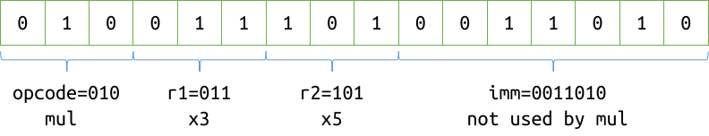
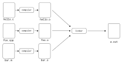
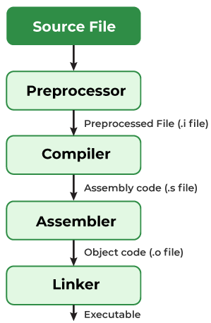

- 关于Quiz
  - 总体难度：难题居多，如果考的不好，不要太过担心，好好总结。期中考试会把握简单题、中等题、难题的比例，但是形式类似。
  - 第5题的第三个得分点（9分）超出课程范围，实际没人得到，是出卷的失误。
- 关于习题课
  - 每个人应该遵循预习、学习、复习的学习周期，或者其他可以学会的方式。这是学习者的责任和义务。
  - 习题课/助教是正课/老师的辅助，而不是重复。
  - 习题课如果再把上课的内容重复一遍，是对于认真学习学生的不尊重。
  - 这周收到的建设性意见：每个知识讲之前补充<u>**前置知识**</u>的信息。
- 关于助教工作
  - 若课上的内容任何不懂，可以加我微信/QQ，或者通过QQ群找到其他助教解答。
- 关于C和C++，课程过半（形式上）的总结和展望

---

# CS100 Recitation 5 — Week 6

## From Xiao Liu

---

# Contents

- **Function Pointers**
- **Redirection & File I/O**
- **`struct`**
- **`enum`, `union`, Bit-fields**
- **Storage-class Specifiers**

---

# Explanation

This recitation is divided into two parts. The first part, which covers up to bit-fields, **may be relevant for the exam.** The second part is designed to help students better understand the use of `static` and is **optional**; those who have other arrangements or do not wish to stay can ***<u>feel free to leave early</u>***.

---

# Function Pointers

- **Intention**
- **Definition** 
- **Syntax**
- **Usage**
  - **Invoke the pointed-to function**
  - **Passing a function pointer into another function**

---

# Intention

- Assume that we plan to use a **sorting algorithm** in one of our functions. 

- At the **<u>compile time</u>**, we are not sure which sorting algorithm to use since we may not know the size of the data set $n$.
  - For example, if $n < 100$,  we may use something like insertion sort,
  - or if $n$ is large, then we may decide to use something like quick sort.

- C provides an interesting way to achieve this by allowing the programmer to decide the algorithm at ***<u>runtime</u>***.

---

# Definition

- Function pointers are pointers, **i.e. variables**, which ***point to an address of a function***.

- 
  > The running programs get a certain space in the main memory. Both, the executable compiled program code and the used variables, are put inside this memory. Thus a function in the program code is also an address. 
  
  Functions in C have a unique address.

- A function can take a**n address (a function pointer) of another function** as an argument.

---

# Syntax - Declaration

```c
return_type (* pointer_name) (datatype_arg_1, datatype_arg_1, ...);
```
**Declaring** a function pointer in C is similar to declaring a function except that when a function pointer is declared, we **prefix its name with the `*`(asterisk) symbol**.

**For example,** if a function  has the declaration
```c
float foo(int, int);
```
Declaration of a function pointer pointing to `foo()` will be
```c
float (* foo_func_pointer) (int, int);
```
- Here ***variable*** `foo_func_pointer` stores the address of **a function that takes two arguments of type `int` and returns a `float`.**

---

# Example

```c
void *(*fp) (int *, int *);
```

- Type of `fp`: a function pointer;
- The **pointee function**'s arguments' types: `int *`, `int *`;
- The `pointee function`'s return type: `void *`.

---

# Syntax - Definition

```c
void f(int);
void (*pf1)(int) = &f;
void (*pf2)(int) = f; // same as &f
```

- A pointer to function can be initialized with an address of a function. **Because of the function-to-pointer conversion, the address-of operator is optional**.
  - See [CppReference - Implicit_conversion - Function_to_pointer_conversion](https://en.cppreference.com/w/c/language/conversion#Function_to_pointer_conversion) for further information.

---

# Syntax - Definition

Compatibility of function types **ignores top-level `const`s** of the function parameters.
```c
int f(int), fc(const int);
int (*pc)(const int) = f; // OK
int (*p)(int) = fc;       // OK
pc = p;                   // OK
```
- Pointers to functions whose parameters only differ in their top-level `const`s are **interchangeable**.
  - Qualifier `const` appears at the **top-level** of a parameter type:
    ```c
    int f(char *const p);
    ```
  - Qualifier `const` appears at the **low-level** of a parameter type:
    ```c
    int f(char const *p);
    ```

---

# Usage: Invoke the pointed-to function

Suppose we declare a function **and its pointer** as given below.
```c
int (*pointer) (int); // function pointer declaration
int areaSquare (int); // function declaration
pointer = areaSquare;
```

To call the function areaSquare, we can create a function call using any of the three ways.

<div class="columns">
<div class="columns-left">

```c
int length = 5;
// 1. using function name
int area = areaSquare(length);

// 2. using function pointer (a)
int area = (*pointer)(length);

// 3. using function pointer (b)
int area = pointer(length);
```

</div>

<div class="columns-right">

- The effect of invoking functions via pointers or by their names is identical.
- While the use of the indirection operator (`*`) is not mandatory, its inclusion is **advised** to enhance readability.

</div>
</div>

---

# Usage: Passing function pointers to another function

```c
#include <stdio.h>

void swap(int *a, int *b){
   int* tmp = a; 
   a = b;
   b = tmp;
}

int main(void){
  void (*ptr)(int *, int *) = swap;   // = &swap;

  int x = 10, y = 20;
  printf("Values of x: %d and y: %d before swap\n", x, y);
  
  (*ptr)(&x, &y);
  printf("Values of x: %d and y: %d after swap", x, y);
  return 0;
}
```

---

# Exercise: Array of Function Pointers

- An array is a data structure that stores a collection of identical data types. Similar to other data types, we can **create an array to store function pointers**.

- Given two operands of type `int` (you need to read them using `scanf`), we need to perform four operations on them sequentially: addition, subtraction, multiplication, and division. Design a structure that utilizes function pointers for these operations.

---

# Redirection & File I/O

- **Redirection**
  - **Standard Input and Output Streams**
  - **Command Line Arguments**
  - **During Run-time**
- **File I/O**
  - **Absolute & Relative Path**

---

# Redirection
- **Standard Input and Output Streams**
- **Command Line Arguments**
- **During Run-time**
  - **`freopen`**

---

# Standard Input and Output Streams

- **`stdin` (Standard Input Stream)**  
  - Commonly associated with the keyboard as the input source.
  - Functions that default to `stdin` for input include: `scanf`, `getchar`.

- **`stdout` (Standard Output Stream)**  
  - Typically linked to the screen for displaying output.
  - Functions that default to `stdout` for output include: `printf`, `putchar`, `puts`.

<br/>

**What is a '*non-standard*' input/output stream?**  
  
--- 

<div class="columns">
<div class="columns-left">

# Redirection（重定向）

A "faucet" model:

- **Source**: `stdin`/`stdout` and files
- You can switch between `stdin`/`stdout` and files.
- This switching mechanism is known as **redirection**.

</div>

<div class="columns-right">


</div>
</div>

---

# Redirection: Command Line Arguments

- By default, when a program is executed in the terminal, both `stdin` and `stdout` are connected to the terminal.
- **Input Redirection**:  
  `./program < input_file.txt` redirects `stdin` to read from `input_file.txt`.
- **Output Redirection**:  
  `./program > output_file.txt` redirects `stdout` to write to `output_file.txt`.
  - If the file **does not exist**, it will be **created**.
  - If the file **exists**, its contents will be **overwritten**.
  - Use `./program >> output_file.txt` to ***append to the file*** rather than overwrite it.
- **Simultaneous Input and Output Redirection**:  
  `./program < testcases/3.in > output.txt` 

---

# Redirection: During Runtime

- In the previous slide, redirection information was passed as **program arguments**, and the system scanned it **before executing the program**.

- You can also specify redirection dynamically **during the program’s execution**. The following standard library functions are useful for this purpose: 

  - [`freopen`](https://en.cppreference.com/w/c/io/freopen): enables redirection within your code **at runtime**.
  
  - [File I/O Functions](https://en.cppreference.com/w/c/io): Functions such as `fopen`, `fclose`, `fscanf`, `fprintf`, `fputs`, and `fgets` are essential for file handling.

  ***Note**: Refer to <u>cppreference</u> for detailed information on using these functions.*

---

# `freopen`

```c
FILE* freopen(const char* filename, const char* mode, FILE* stream);
```
Closes the file associated with `stream`, then attempts to open `filename` and associate that file with the specified file stream.

<div align="center">

| File Access Mode String | Meaning           | Description                    |
| ----------------------- | ----------------- | ------------------------------ |
| `"r"`                   | Read              | Opens a file for reading        |
| `"w"`                   | Write             | Creates a file for writing      |
| `"a"`                   | Append            | Appends to a file               |
| `"r+"`                  | Read/Write        | Opens a file for reading/writing|
| `"w+"`                  | Write/Read        | Creates a file for reading/writing |
| `"a+"`                  | Append/Read       | Opens a file for appending/reading |

</div>

---

# `freopen`: Examples

```c
FILE* freopen(const char* filename, const char* mode, FILE* stream);
```

<div align="center">

| File Access Mode String | Meaning           | Description                    |
| ----------------------- | ----------------- | ------------------------------ |
| `"r"`                   | Read              | Opens a file for reading        |
| `"w"`                   | Write             | Creates a file for writing      |

</div>

## Examples:

```c
freopen("testcases/3.in", "r", stdin);
freopen("output.txt", "w", stdout);
```

---

# File I/O

- **Overview**
- **Path of Files or Directories**
- **Absolute & Relative Path**
---

# File I/O: Overview

```c
FILE *infile = fopen("relative/path/to/my/input/file", "r");
int a, b;
fscanf(infile, "%d%d", &a, &b);
FILE *outfile = fopen("relative/path/to/my/output/file", "w");
fprintf(outfile, "%d\n", a + b);
fclose(infile);
fclose(outfile);
```

- **`fopen`**: Opens a file and returns a pointer of type `FILE *` (file pointer).

- **`fclose`**:  Closes a file; the parameter is a `FILE *` pointer.

- **`fscanf`, `fprintf`, `fputs`, `fgets`, `fputc`, `fgetc`**: These functions **take an additional parameter of type `FILE *`** compared to their "non-`f`" versions.

  - When `stdin` or `stdout` is passed, they behave **the same as** their "non-`f`" counterparts.

---

# Path of Files or Directories

- Paths in a computer system refer to **the hierarchical way** of specifying **the location of a file or directory**. Paths are crucial for the **operating system** as they enable it to locate and access files and directories.

<br/>

**There are two types of paths:**
- **Absolute path**. The complete, unambiguous route to a file or directory ***from the system root***.
- **Relative path**. The location of a file or directory ***in relation to the current working directory***.

---

# **Absolute** & Relative Path

**Examples:**
```
Linux:      /home/user/documents/file.txt
Windows:    C:\Users\User\Documents\file.txt
```


- An **absolute path** provides a complete description of a file's location, starting from the root directory of the operating system's file system to its specific location.
  - It always **begins at the root of the storage device** (SSD or HDD), detailing every step required to navigate through the file system to reach the specified file.
- The representation of an absolute path **varies depending on the operating system**:
  - In Unix-like operating systems, the root directory is indicated by a forward slash (`/`).
  - In Windows, it is represented by a drive letter followed by a backslash (e.g., `C:\`).

---

# Absolute & **Relative Path**

A relative path is a file path that is relative to the **current working directory** (use the command `pwd` to check it). This means that the file location is **described relative to the current directory**, rather than starting from the root of the file system.

The `./` and `../` symbols act like directions from your present location:
  - `./` means "starting from the current directory" and is optional.
  
    - You can input just the file name to access files **located in the current directory**.
  
  - `../` means "starting from the current directory, go up one level," and is required when navigating up the directory structure.

---

# Examples: Relative Path

- Access a file in the current directory:
    ```bash
    cat file.txt
    ```
- Navigate up one directory and access a file:
    ```bash
    cd ../
    cat otherfile.txt
    ```
    Or, you can directly type:
    ```bash
    cat ../otherfile.txt
    ```

---

# `struct`

- **Basics**
- **Usage in Functions**
- **`typedef`**

---

# `struct`: Basics

- **Intention**
- **Basics**
- **Initialization**
- **Assignment**
- **Copying**

---

# Intention

- to define a **composite** type, consisting of a fixed set of labeled elements.
- useful for representing real-world or abstract entities **characterized by multiple attributes**

<div style="display: grid; grid-template-columns: 1fr 1fr 1fr;">
  <div>

```c
struct Student {
  const char *name;
  const char *id;
  int entrance_year;
  int dorm;
};
```
  </div>
  <div>

```c
struct Record {
  void *ptr;
  size_t size;
  int line_no;
  const char *file_name;
};
```
  </div>
  <div>

```c
struct brainfuck_state {
  uint8_t *memory_buffer;
  size_t offset;
  // ...
};
```
  </div>
</div>

<div style="display: grid; grid-template-columns: 1fr 1fr;">
  <div>

```c
struct Point3d {
  double x, y, z;
}; 
```
  </div>
  <div>

```c
struct Line3d {
  struct Point3d p0, direction;
};
```
  </div>
</div>

---

# Basics

- A `struct` is a type that consists of a sequence of members, with storage allocated **in an ordered sequence**.
  - The value set $\mathcal X$ of a `struct` object is the **Cartesian product** of the value sets of its members.
  $$
  \mathcal X=\mathcal T_1\times\cdots\times\mathcal T_n=\left\{\left(t_1,\cdots,t_n\right)\mid t_1\in\mathcal T_1,\cdots,t_n\in\mathcal T_n\right\}
  $$

- Size of a `struct`: (determined by alignment considerations)

$$ \mathtt{sizeof(struct\ \ X)}\geqslant\sum_{\mathtt{member}\in\mathtt{X}}\mathtt{sizeof(member)} $$

- Declaration: `struct structName variableName;`

- Type of a `struct` object: `struct structName` (the keyword `struct` **must not** be omitted)

---

# Basics

- A `struct` cannot have **a member of its own type**.
  - It is not allowed to have a member of an *incomplete type* within a `struct`.
  - A `struct` type is considered [**incomplete**](https://en.cppreference.com/w/c/language/type#Incomplete_types) until the end of its definition.

    <div class="columns">
    <div class="columns-left">

    ```c
    struct A {
      int x;
      struct A a;
    };
    ```

    </div>
    <div class="columns-right">

    - `sizeof(struct A)` $= +\infty$
    - Physically, it is impossible to store such an object in memory.
    </div>
    </div>

    An incomplete type lacks sufficient information to **determine its size**.
- However, a pointer to its own type is allowed (e.g., linked lists).
  - A pointer to a `struct` can be cast to **a pointer to its first member**.
  - There may be memory padding between any two members of a `struct` or after the last member, **but not before the first member**.

---

# `struct`: Initialization

```c
struct Record {
  void *ptr;
  size_t size;
  int line_no;
  const char *file_name;
};
```

**Method 1**: Using a general **initializer list**:

```c
struct Record r = {p, cnt * each_size, __LINE__, __FILE__};
```
- The order of values in the initializer list **must match the order of their declaration**.

---

# `struct`: Initialization (cont.)

```c
struct Time {
    int sec, min, hour, day, mon, year;
};
```

**Method 2**: Using ***designators*** (*since C99*, *since C++20*):

```c
struct Time today = {.day=25, 10, 2024, .sec=30, 25, 18}; 
```
- `.day`, `.sec` are examples of **designators**.
- The initialization order is determined by the designators:
  - Members not explicitly initialized with designators are initialized in the order of their declaration.
  - The order of designators in the initializer list **does not** need to match the order of declaration.
- For more details, refer to [CppReference: Struct Initialization](https://en.cppreference.com/w/c/language/struct_initialization).

---

# `struct`: Assignment

```c
struct Record {
  void *ptr;
  size_t size;
  int line_no;
  const char *file_name;
};
```

You **cannot use an initializer**, with or without designators, to directly assign values to a `struct` object.

```c
struct Record r;
r = {p, cnt * each_size, __LINE__, __FILE__};         // Error
```

```c
struct Record records[10];
records[i] = {.ptr = p, .size = cnt * each_size,
              .line_no = __LINE__, .file = __FILE__}; // Error
```

---

# `struct`: Assignment (cont.)

**Method 1:** Assign values member by member.
```c
struct Record r;
r.ptr = p;
r.size = cnt * each_size;
// ...
```
<br/>

**Method 2 (Recommended):** Use a [**compound literal**](https://en.cppreference.com/w/c/language/compound_literal).
```c
struct Record r;
r = (struct Record){p, cnt * each_size, __LINE__, __FILE__};
```
- A compound literal is an *lvalue*, meaning i**ts address can be taken** and stored in memory for the duration of its lifetime.

---

# `struct`: Copying

- Copying a `struct` is performed as a **member-by-member** operation.
  - If a **member is an array**, the array is also copied element by element.

**Example**

```c
struct Student {
  const char *name;
  const char *id;
  int entrance_year;
  int dorm;
};
struct Student a = {"Alice", "2023531001", 2022, 8};
struct Student c = something();
c = a;    // assignment
```

The assignment is equivalent to:

```c
c = (struct Student){a.name, a.id, a.entrance_year, a.dorm};
```

---

# `struct`: Usage in Functions

- **Argument Passing and Return Values**

- **Application of Returning a `struct`**

---

# `struct`: **Argument Passing** and Return Values

- **Passing arguments:**

  ```c
  void foo(struct Record a){
    // ...
  }
  foo(records[i]);
  ```
  In C, arguments are passed by value, meaning the `struct` is copied. The parameter `a` is initialized by copying the `struct` as follows:

  ```c
  struct Record r = {records[i].ptr, records[i].size,
                    records[i].line_no, records[i].file_name};
  ```

---

# `struct`: Argument Passing and **Return Values**

```c
struct foo(void){
  struct Record r = something();
  // ...
  return r;
}
records[i] = foo();
```

When returning a `struct` from a function, the operation is still a copy:
  - Initially, the local variable `r` is copied to a temporary variable, for example, `tmp`. That is, `struct Record tmp = r`. 
  - Then, the return value of `foo()`, which is `tmp`, is assigned to `records[i]`, equivalent to `records[i] = tmp`.
  - However, the temporary variable `tmp` is **not actually created** in most cases. Modern compilers eliminate the unnecessary copies of intermediate variable using a technique called [Return Value Optimization (RVO)](https://en.wikipedia.org/wiki/Copy_elision#RVO).

---

# `struct`: Application of Returning a `struct`

By packaging function outputs into a `struct`, we can return multiple values to the caller **simultaneously** in a way that is **semantically coherent**.
```c
struct minmax_result { int min; int max; };

struct minmax_result minmax(int *array, int n) {
  // ...
  return (struct minmax_result){INT_MIN, INT_MAX};
}
```
An alternative approach to returning multiple values involves **passing additional pointers** into the function to manipulate the pointed objects directly.
```c
void minmax(int *array, int n, int *min, int *max);
```
  - The distinction between ***the actual return value*** and ***the values passed in via pointers*** creates **semantic inconsistency**.

---

# `typedef`

---

# [`typedef`](https://en.cppreference.com/w/c/language/typedef): Type Alias

- A **`typedef` declaration** allows you to create an alias for a type, simplifying potentially complex type names.
  ```c
  typedef int int_t;         // int_t is now an alias for int
  typedef char char_t, *char_p;  // char_t -> char, char_p -> char*
  ```
- **Using `typedef` with `struct`:**
  ```c
  typedef struct Books {
    char title[50];
    char author[50];
    int book_id;
  } Book;
  ```
  This allows you to declare a `struct Books` object without the `struct` keyword, as `Book` becomes an alias for `struct Books`:
  ```c
  Book myBook; // No need to use 'struct Books'
  ```

---

# `enum`,`union`, Bit-fields

---

# Enumerations (Enum): Definition

### Definition: 

```c
enum flag {enumeration_constant1, enumeration_constant2, ...};
```
- By default, `enumeration_constant1 == 0`, `enumeration_constant2 == 1`, and so on. You can also **customize** the values of constants:
  ```c
  enum suit {club = 0, diamonds = 10, hearts = 20, spades = 3};
  ```

- Each `enumeration_constant` in an enumeration specifier becomes an ***integer constant***, allowing its use wherever integer constants are required (e.g., as **a `case` label** or as **a non-VLA array size**).

- Refer to [CppReference: Enumeration](https://en.cppreference.com/w/c/language/enum) for further details.

---

# Enumerations (Enum): Usage

- Use `enum` to avoid magic numbers.

<div style="display: grid; grid-template-columns: 1fr 1fr;">
  <div>

```c
struct Text {
  int color; // 0 black, 1 red, 2 green
  char *contents;
};

// in some function
struct Text text = something();
text.color = 0; // set to black
```

</div>
<div>

```c
enum TextColor { Black, Red, Green };
struct Text {
  enum TextColor color;
  char *contents;
};

// in some function
struct Text text = something();
text.color = Black; // set to black
```

</div>
</div>

---

# Enumerations (Enum): Declaration

### Declaration: 
```c 
enum flagName variableName_of_the_enum_type;
```

- You can **concatenate** the definition and the declaration to create an **object of the enumeration** directly:
  ```c
  enum boolean {false, true} check; 
  ```

---

# Enumerations (Enum): Example

```c
#include <stdio.h>

enum week {Sunday, Monday, Tuesday, Wednesday, Thursday, Friday, Saturday};

int main(void){
    // creating today variable of enum week type
    enum week today;

    today = Wednesday;
    printf("Day %d\n",today + 1);
    return 0;
}
```
**Output**: 
```bash
Day 4
```

---

# [`union`](https://en.cppreference.com/w/c/language/union): Sharing Storage

- A `union` is *a type opposed to a `struct`*, as its members **share** the same memory location.

    - The storage for the members is **overlapping**.

    - The memory occupied by a union is large enough to hold **the largest member** of the union.

    - **<u>At most one member</u>** of a union can store data at any one time.

- **Semantics**: It functions similarly to a "disjoint union."

  $$
  \mathcal X=\mathcal T_1\sqcup\cdots\sqcup\mathcal T_n=\left\{\left(t_i,i\right)\mid t_i\in\mathcal T_i,i\in\{1,\cdots,n\}\right\}
  $$

  $$
  \mathtt{sizeof(union\ \ X)}\geqslant\max_{\mathtt{member}\in\mathtt{X}}\mathtt{sizeof(member)}.
  $$

---

# `union`: Example 1

```c
union Data {
   int i;
   float f;
   char str[20];
} data;
```

- A variable of the `Data` type can store either an integer, a floating-point number, or a string of characters.

- This means that the variable `data` can be used to **store multiple types of data** at different times and only **occupies one unit of sufficient memory**.

---

# `union`: Example 1.1

<div class="columns">
<div class="columns-left">

```c
#include <stdio.h>
#include <string.h>

union Data {
    int i;
    float f;
    char str[20];
};

int main(void) {
    union Data data;
    printf("size: %zu\n", sizeof(data));
    data.i = 10;
    data.f = 220.5;
    strcpy(data.str, "C Programming");
    
    printf("data.i : %d\n", data.i);
    printf("data.f : %f\n", data.f);
    printf("data.str : %s\n", data.str);
    
    return 0;
}
```

</div>

<div class="columns-right">

**Output**:

```bash
size: 20
data.i : 1917853763
data.f : 4122360580327794860452759994368.000000
data.str : C Programming
```

<br/>

The values of the `i` and `f` members of the union display garbage data because **the final value assigned to the variable has occupied the memory location**. This explains why the value of the `str` member is printed correctly.

</div>
</div>

---

# `union`: Example 1.2

<div class="columns">
<div class="columns-left">

```c
#include <stdio.h>
#include <string.h>

union Data {
    int i;
    float f;
    char str[20];
};

int main(void) {
    union Data data;
    data.i = 10;
    printf("data.i: %d\n", data.i);
    data.f = 220.5;
    printf("data.f: %f\n", data.f);
    strcpy(data.str, "C Programming");
    printf("data.str: %s\n", data.str);
    
    return 0;
}
```

</div>

<div class="columns-right">

**Output**:

```bash
data.i: 10
data.f: 220.500000
data.str: C Programming
```

<br/>

All the members are printed correctly because **only one member is being used at a time**.

</div>
</div>

---

# `union`: Example 2

**Background**: An IP address can be of two types: `IPv4` (4 bytes) and `IPv6` (16 bytes).

```c
union IP {
    char ipv4[4];
    char ipv6[16];
}; // sizeof(IP) = 16
```

The `union IP` allows us to store an IP address of **unknown length (type)** without significant waste of storage space.

--- 

# Bit-fields: Example *(Implementation-defined)*

```c
struct Instruction {
  unsigned imm : 7;
  unsigned r2 : 3;
  unsigned r1 : 3;
  unsigned opcode : 3;
}; // sizeof(struct Instruction) == 7 + 3 + 3 + 3
```

<a align="center">
  
</a>

```c
unsigned short x; scanf("%hx", &x);
struct Instruction i= *(struct Instruction *)&x;
// Now you can use i.opcode, i.r1, i.r2, i.imm directly.
```

---

# [Bit-fields](https://en.cppreference.com/w/c/language/bit_field): Basics

- A bit-field member is declared with **explicit width** in bits. Adjacent bit-field members may **be packed to share and straddle individual bytes**.
- Bit-fields can be applied to either a member of a `struct` or a `union`. 

<div class="columns">
<div class="columns-left">

```c
struct BitField {
    type identifier1 : width1;
    type identifier2 : width2;
    // ...
};
```

</div>

<div class="columns-right">

```c
union BitField {
    type identifier1 : width1;
    type identifier2 : width2;
    // ...
};
```

</div>
</div>

- It is important to note that **a bit-field can only have one of the following four types**:
  - `unsigned int`, `signed int`, `int`, or `_Bool`.

--- 

# Bit-fields: Types of Bit-fields

- `unsigned int`
    - `unsigned int b:3;` : has the range $[0, 7]$
- `signed int`
    - `signed int b:3;` : has the range $[-4, 3]$
- `int` : signed-ness is  **implementation-defined**  (`int` $\neq$ `signed int` here)
    - `int b:3;`: may have a range of values that is either $[0, 7]$ or $[-4, 3]$

- `_Bool`: a **single-bit** bit-field
    - `bool x:1;` : has the range $[0, 1]$ 
    - Implicit conversions to and from `_Bool` follow the [boolean conversion rules](https://en.cppreference.com/w/c/language/conversion#Boolean_conversion).

---

# The following part is **optional**. 
# You are welcome to leave if you have prior commitments.

--- 

# Storage-class Specifiers
- **Scope and Lifetime**
- **Linkage**
- **Implicit Initialization**

---

# Scope and Lifetime
  - **Translation Unit**
  - **Scope and Lifetime**
  - **Storage Duration**

--- 

# Prerequisite: Translation Unit (Compilation Unit)

<div class="columns">
<div class="columns-left">

- In C and C++ programming terminology, a translation unit is the final **input** to a **C or C++ compiler**, from which an object file is generated.
- A translation unit typically consists of a source file that has been *processed by the C preprocessor*.
  

</div>
<div class="columns-right">




</div>
</div>


- This means header files have been included, conditional sections (e.g., those controlled by `#ifndef`) have been resolved, and macros have been expanded.

---

# Scope and Lifetime

- **Scope**: The section of **code** where a variable is accessible.
  - Each [identifier（标识符）](https://en.cppreference.com/w/c/language/identifier) that appears in a C program is visible (that is, may be used) only in some possibly discontiguous portion of the source code.

- **Lifetime($\approx$ storage duration)**: The **time duration** during program execution when an ***object*** is valid (exists, has a constant address, retains its last-stored value) and can be used.
  - Accessing an object outside of its lifetime results in **undefined behavior**.
  - A pointer to an object whose lifetime ended **has indeterminate value**.

--- 

# Example: Static local variable inside a function

<div class="columns">
<div class="columns-left">

```c
#include <stdio.h>
void count_calls(void) {
    // static local variable
    static int count = 0;  
    count++;
    printf("%d times\n", count);
}
int main(void) {
    count_calls();  // First call
    count_calls();  // Second call
    count_calls();  // Third call
    return 0;
}
```
```
called 1 times
called 2 times
called 3 times
```


</div>
<div class="columns-right">

**`count`**: 
- Scope:
  - declared inside `count_calls()`
  - its scope is limited to the function
  - cannot be accessed or modified ***directly*** outside of this function

- Lifetime:
  - begins **when the program starts**, and it remains in memory until the program terminates

</div>
</div>


---

# Example: Accessing an object outside of its **lifetime**

```c
int* dangling_pointer(void) {
    int x = 5;  /
    return &x; 
}

int main(void) {
    int *ptr = dangling_pointer();  
    // ptr points to a local variable that no longer exists
    printf("%d\n", *ptr);  
    // Undefined behavior: accessing a variable after its lifetime
    return 0;
}
```

The behavior to access the return value of `dangling_pointer()` in the `main` function is **undefined** since the variable `x`'s lifetime has ended before the `dangling_pointer` return to its caller `main`.


--- 

# Example: Accessing an object outside of its **scope**


<div class="columns">
<div class="columns-left">

- Example 1: Accessing global variable in a function while the varibale is not in the local scope of the function.

```c
#include <stdio.h>

int global_x = 42;

void foo(void) {
  // local scope of foo() begins
  printf("%d\n", global_x);  
}

int main(void) {
  foo(); 
  return 0;
}
```

</div>
<div class="columns-right">

- Example 2: Accessing variable outside its scope through pointer.
```c
#include <stdio.h>

void modify_value(int *ptr) {
  *ptr = 20;
  printf("%d\n", *ptr);
}

int main(void) {
  int x = 10;  
  modify_value(&x);

  printf("%d\n", x);

  return 0;
}
```
</div>
</div>


---

# Scope

**When scopes overlap, the declaration in the inner scope **hides** the declaration from the outer scope.**

- **Block scope**: Applies to function bodies, `if`, `switch`, `for`, `while`, `do-while` statements, and the parameter list of a function definition.
  - Begins **at the point of declaration** and ends at the end of the block or statement where it was declared.
- **File scope**: Applies to identifiers declared outside of any block or parameter list.
  - Begins at the point of declaration and ends at the end of **the translation unit**.
- **\*Function prototype scope**: `int f(int n, int a[n]);`
Refers to a name introduced in the parameter list of a function declaration (not definition).
  - Ends at the end of the function [declarator](https://en.cppreference.com/w/c/language/declarations).
- ***\*Function scope***, ***\*Point of declaration***: Beyond the class’s scope.


---

# Variables: Nested Scopes

```c
int a;   // file scope of name a begins here
 
void f(void){
  int a = 1; // the block scope of the name a begins here; 
              // hides file-scope a
  {
    int a = 2;         
    // the scope of the inner a begins here, outer a is hidden
    printf("%d\n", a);  // inner a is in scope, prints 2
  } // the block scope of the inner a ends here

  printf("%d\n", a);    // the outer a is in scope, prints 1

} // the scope of the outer a ends here

void g(int a);   
// name a has function prototype scope; hides file-scope a;
// a is just a placeholder and is not accessible outside the prototype
```
---

# Storage Duration - Limiting the object **lifetime**

- **automatic storage duration**: exists only at certain points during execution
  - Applies to function parameters, non-`static` block scope objects, *compound literals* used at block scope.
  - Storage is allocated **when the block** where the object was decalred **is entered** and deallocated when it is exited
- **static storage duration**:  has entire program life duration
  - Applies to **all objects declared `static`** and all objects with linkage.
  - The storage duration is the **entire execution of the program**.
  - The value stored in the object is initialized **only once**, prior to main function.
- **allocated storage duration**: has a lifetime determined by the programmer
  - Allocated and deallocated by request (dynamic memory allocation functions).
- **\*thread storage duration**: *beyond the class's scope*

---

# Scope and Storage duration

<div align="center">

| Type                     | Example                          | Scope | Duration  | 
| ------------------------ | -------------------------------- | ----- | --------- |
| Local variable           | `int x;`                         | Block | Automatic |
| Static local variable    | `static int s_x;`                | Block | Static    |
| Function parameter       | `void foo(int x)`                | Block | Automatic |
| Internal global variable | `static int g_x;`                | File  | Static    |
| External global variable | `int g_x;`                       | File  | Static    |

</div>

---

# Linkage

- **Overview**
- **Linkage and CALL**
- **Scope, Storage duration and Linkage**
- **`static` keyword**
- **`extern` keyword**

---

# Linkage: **The ability to be referenced** in other scope

Linkage refers to **the ability of an identifier** (variable or function) to be referenced **in other scopes**. The following types of linkage are recognized:

- **No linkage**: The identifier can only be referenced **from within its own scope**.
  - Applies to all function parameters and all non-`extern` block scope variables (including the ones declared `static`).
  
- **Internal linkage**: The identifier can be referenced **within the current translation unit**.
  - Applies to all `static` **file-scope** identifiers (both functions and variables).

- **External linkage**: The identifier can be referenced **from any other translation units**.
  - Applies to all non-`static` functions, all `extern` variables (unless earlier declared `static`), and all file-scope non-`static` variables.

---

<div class="columns">
  <div class="columns-left">

# Linkage and CALL

- In a C program with multiple source files, each file is compiled one at a time and linked into a single executable.
- Until the compilation process, the scope of a variable defines its visibility and accessibility.
  - The compiler utilizes the property of **scope**.

  </div>
  <div class="columns-right">

  

  </div>
</div>

- It is during the linking process that the linkage property comes into play:
  - Should a variable be accessible for use in another file?
  - Should a variable be restricted to use only within the file it was declared?

---

# Scope, Storage duration and Linkage

<div align="center">

| Type                     | Example                          | Scope | Duration  | Linkage  | 
| ------------------------ | -------------------------------- | ----- | --------- | -------- |
| Local variable           | `int x;`                         | Block | Automatic | None     |
| Static local variable    | `static int s_x;`                | Block | Static    | None     |
| Function parameter       | `void foo(int x)`                | Block | Automatic | None     |
| Internal global variable | `static int g_x;`                | File  | Static    | Internal |
| External global variable | `int g_x;`                       | File  | Static    | External |

</div>

---

# Scope, Storage duration and Linkage

- All objects with either internal or external linkage have static sotrage duration.
- Block scope variables have no linkage and automatic storage duration by default. 
  - Storage duration for local variables begins when the block is entered, but until the declaration is seen, the variable is not in scope and cannot be accessed.
- File-scope identifiers have external linkage and static storage duration by default.
  - ***How are these identifiers referred to from other translation units, given that their scopes are only within their own translation unit?***
  > CppReference:
  If a variable or function with the same **identifier** is declared in several scopes, but cannot be referred to from all of them, then **several instances of the variable are generated**.


---

# Internal Linkage: `static` Keyword

<div class="columns">
<div class="columns-left">

- For block scope variables,
  - grant them static storage duration
  - ensure them to be initialized once

```c
#include <stdio.h>

void counter() {
  static int count = 0; 
  count++;
  printf("%d\n", count);
}

int main(void) {
  counter();  // Output: 1
  counter();  // Output: 2
  counter();  // Output: 3
  return 0;
}
```

</div>
<div class="columns-right">

- For file-scope identifiers (both functions and variables),
  - grant them static storage duration
  - **grant them internal linkage**

```c
#include <stdio.h>

// File-scope static variable
static int file_scope_var = 42;  

// File-scope static function
static void file_scope_function(void){  
  printf("%d\n", file_scope_var);
}

int main(void){
  file_scope_function();
  return 0;
}
```
</div>
</div>

---

# External Linkage: `extern` keyword
The extern specifier specifies **static storage duration** and **external linkage**. It can be used with function and object ***declarations*** in **both file and block scope**.

---

<div class="columns">
<div class="columns-left">

# Example 1 of `extern`

File 1: `file1.c`

```c
#include <stdio.h>

// Definition of a global variable
int shared_variable = 42;  

void display_variable(void) {
  printf("%d\n", shared_variable);
}
```

- In `file1.c`, `shared_variable` is defined as a global variable.
- In `file2.c`, we declare it using extern, which allows us to access and modify `shared_variable` from `file1.c`.

</div>

<div class="columns-right">

File 2: `file2.c`

```c
#include <stdio.h>

extern int shared_variable;  
void display_variable(void);

void modify_variable(void) {
  // Modifying the external variable
  shared_variable = 100; 
}

int main(void) {
  modify_variable();  
  printf("%d\n", shared_variable);
  return 0;
}
```
Output:
```
42
100
```
</div>
</div>

---

# Example 2 of `extern`

<div class="columns">
<div class="columns-left">

File 1: `file1.c`

```c
#include <stdio.h>

// Definition of a global variable
int shared_variable = 42;

void function_with_extern() {
  // Declaration within block scope
  extern int shared_variable;
  // Block scope access
  printf("%d\n", shared_variable);
}
```

</div>

<div class="columns-right">

File 2: `file2.c`

```c
// Declaration of the external variable
extern int shared_variable;
void function_with_extern(void);

int main() {
  // accesses the variable
  function_with_extern();
  return 0;
}
```
Output: `42`.

</div>
</div>

<br>

- `extern` can also be used to declarations of **block scope**.

---

<div class="columns">
<div class="columns-left">

# Example 3 of `extern`

File1: `file1.c`

```c
#include <stdio.h>

static int shared_variable = 42;

void display_variable(void) {
  printf("%d\n", shared_variable);
}
```

</div>

<div class="columns-right">

File2: `file2.c`

```c
extern int shared_variable;
void display_variable(void);

void modify_variable(void) {
  shared_variable = 100;
}

int main(void) {
  modify_variable();
  return 0;
}
```

</div>
</div>

```
 error: linker failed; symbol(s) not found.
```
 - **If extern appears on a redeclaration of an identifier that was already declared with internal linkage, the linkage remains internal.** Otherwise (if the prior declaration was external, no-linkage, or is not in scope), the linkage is external.

--- 

# Implicit Initialization

---

# Implicit Initialization

If a variable is declared without explicit initialization:

- Ojects **with automatic storage duration** (e.g., local non-`static` variables) are initialized to **indeterminate values**. In other words, they are **uninitialized**.
- For objects with static storage duration(e.g., global or local `static` variables), they are [**empty-initialized**](https://en.cppreference.com/w/c/language/initialization#Empty_initialization) (called [zero-initialization](https://en.cppreference.com/w/cpp/language/zero_initialization) in C++):
  - Pointers are initialized to *null pointer values* of their types.
  - Objects of integral types are initialized to `0`.
  - Objects of floating types are initialized to **positive zero** (`0.0`).
    - v.s. <u>***set every bits zero***</u>
  - All elements of arrays, all members of structs, and **the first members** of unions are empty-initialized, recursively, plus all padding bits are initialized to zero.
  
---

# CS100 Recitation 5 — Week 6

## From Xiao Liu